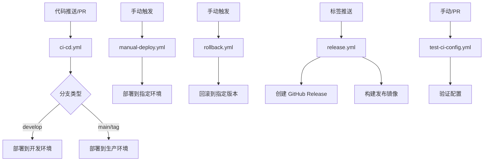

# CI/CD 工作流总览

本文档提供所有 CI/CD 工作流的快速参考。

## 工作流列表

| 工作流 | 触发条件 | 主要功能 | 状态 |
|--------|---------|---------|------|
| **ci-cd.yml** | Push/PR | 代码检查、测试、构建、部署 | ✅ 主要工作流 |
| **codeql-analysis.yml** | Push/PR/定时 | 代码安全分析 | ✅ 已配置 |
| **manual-deploy.yml** | 手动触发 | 手动部署到指定环境 | ✅ 已配置 |
| **rollback.yml** | 手动触发 | 回滚到指定版本 | ✅ 已配置 |
| **release.yml** | 标签/手动 | 创建发布版本 | ✅ 已配置 |
| **test-ci-config.yml** | 手动/PR | 验证 CI/CD 配置 | ✅ 已配置 |

## 工作流流程图



## 快速命令参考

### 查看工作流状态

```bash
# 使用 GitHub CLI
gh run list
gh run view <run-id>
gh run watch <run-id>

# 查看特定工作流
gh run list --workflow=ci-cd.yml
gh run list --workflow=manual-deploy.yml
```

### 触发工作流

```bash
# 手动触发部署
gh workflow run manual-deploy.yml \
  -f environment=production \
  -f image_tag=v1.0.0

# 触发回滚
gh workflow run rollback.yml \
  -f environment=production \
  -f revision=3

# 触发发布
gh workflow run release.yml \
  -f version=v1.0.0

# 验证配置
gh workflow run test-ci-config.yml
```

### 查看日志

```bash
# 查看最新运行日志
gh run view --log

# 查看特定工作流的日志
gh run list --workflow=ci-cd.yml --limit=1 | \
  awk 'NR==2 {print $7}' | \
  xargs gh run view --log
```

## 环境配置

### Development (开发环境)
- **命名空间**: `ceoagent-dev`
- **URL**: `https://dev-api.ceoagent.com`
- **触发**: Push 到 `develop` 分支

### Production (生产环境)
- **命名空间**: `ceoagent`
- **URL**: `https://api.ceoagent.com`
- **触发**: Push 到 `main` 分支或标签 `v*`

## 镜像标签策略

| 标签格式 | 说明 | 示例 |
|---------|------|------|
| `latest` | 最新 main 分支 | `ghcr.io/owner/repo:latest` |
| `main-abc123` | main 分支的 SHA | `ghcr.io/owner/repo:main-abc123` |
| `develop-abc123` | develop 分支的 SHA | `ghcr.io/owner/repo:develop-abc123` |
| `v1.0.0` | 语义化版本 | `ghcr.io/owner/repo:v1.0.0` |
| `v1.0` | 主要版本 | `ghcr.io/owner/repo:v1.0` |
| `v1` | 大版本 | `ghcr.io/owner/repo:v1` |

## 通知配置

所有工作流都支持 Slack 通知（可选）。配置 `SLACK_WEBHOOK` secret 后，以下事件会发送通知：

- ✅ 部署成功/失败
- ✅ 回滚成功/失败
- ✅ 发布创建
- ✅ 构建失败

## 故障排查

### 工作流失败

1. **查看日志**: 点击失败的步骤查看详细日志
2. **检查 Secrets**: 确认所有必需的 Secrets 已配置
3. **验证配置**: 运行 `test-ci-config.yml` 验证配置
4. **查看事件**: 在 Actions 页面查看触发事件

### 常见错误

| 错误 | 原因 | 解决方案 |
|------|------|---------|
| `ImagePullBackOff` | 镜像不存在或无法拉取 | 检查镜像标签是否正确 |
| `kubectl: command not found` | kubectl 未安装 | 使用 `azure/setup-kubectl` action |
| `Health check failed` | 应用未启动或端点不可用 | 检查应用日志和健康端点 |
| `Coverage below threshold` | 测试覆盖率 < 80% | 增加测试覆盖 |

## 最佳实践

1. **小步提交**: 频繁提交代码，快速获得反馈
2. **分支策略**: 
   - `develop`: 开发环境
   - `main`: 生产环境
   - 功能分支: 通过 PR 合并
3. **标签管理**: 使用语义化版本号 (`v1.0.0`)
4. **监控告警**: 配置 Slack 通知及时发现问题
5. **定期验证**: 定期运行 `test-ci-config.yml` 验证配置

## 相关文档

- [详细工作流说明](./README.md)
- [配置检查清单](../CI_CD_SETUP_CHECKLIST.md)
- [CI/CD 文档](../../CICD.md)
- [部署指南](../../DEPLOYMENT.md)
