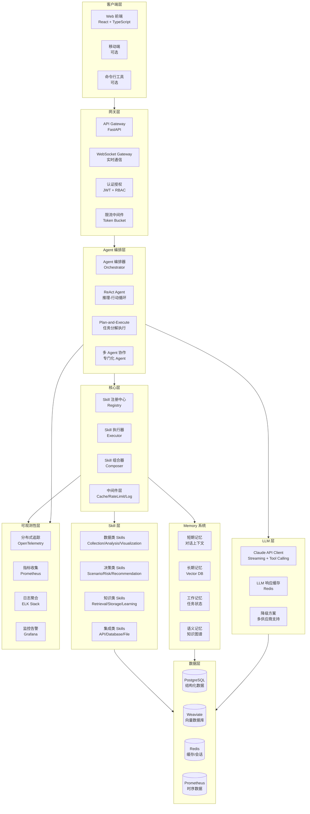
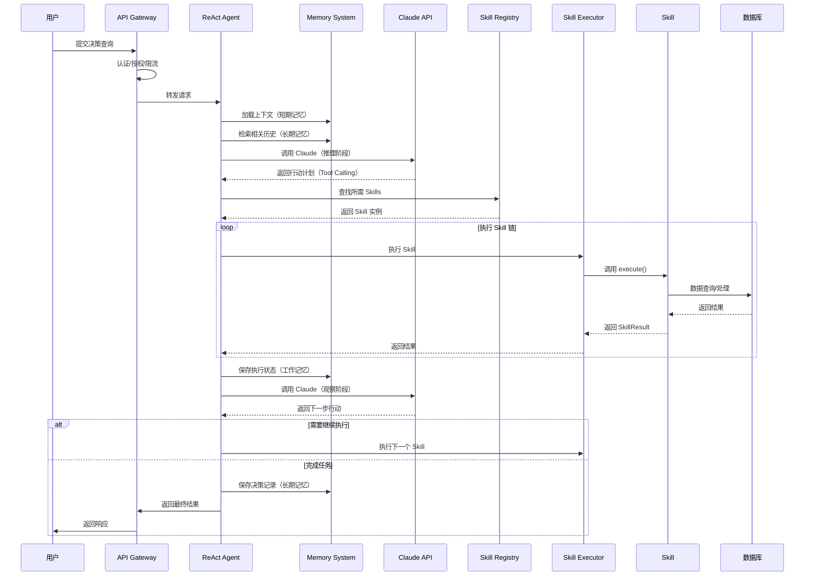
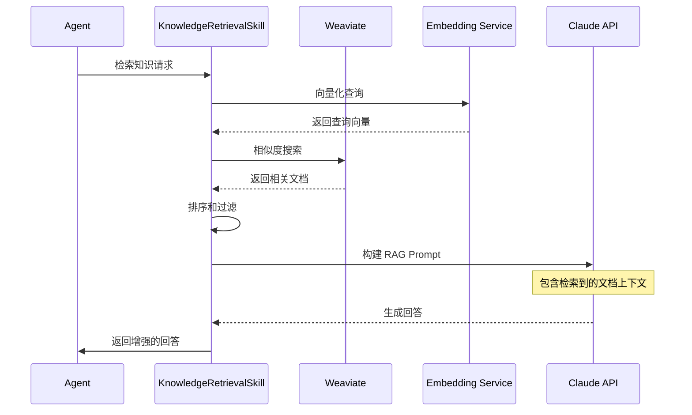
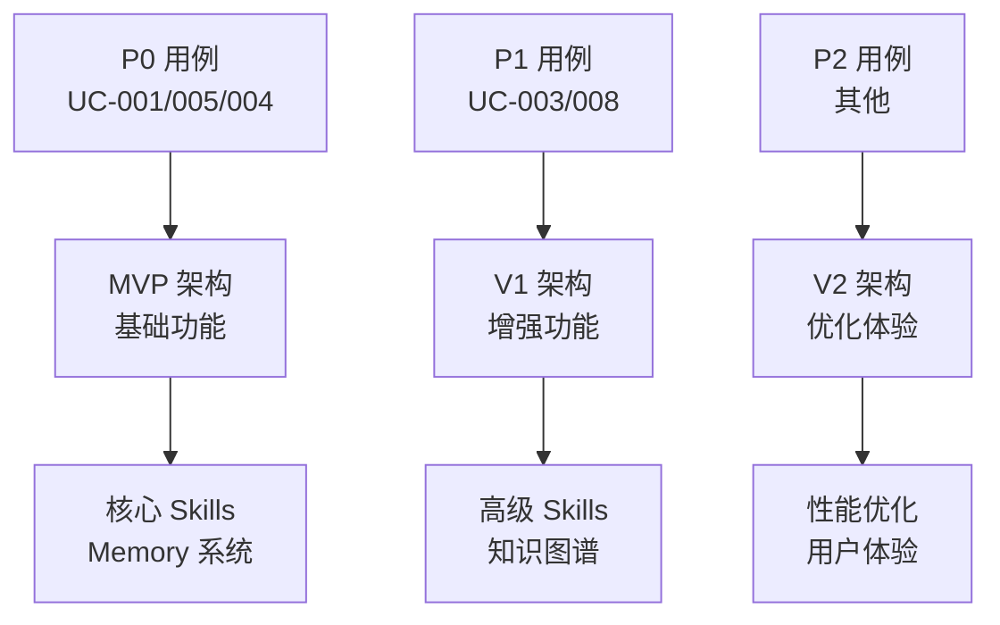
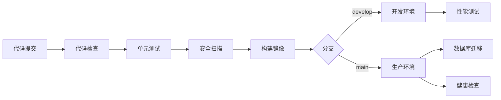

# CEOAgent 系统架构设计

## 架构概览

CEOAgent 采用 **分层、模块化的 Skill-based AI Agent 架构**，结合最新的 AI Agent 技术栈，构建高性能、可扩展、可观测的企业级决策支持系统。

> **提示**：本文档描述了详细的系统架构。如需查看优化后的、基于最新用例和需求的架构方案，请参考 [ARCHITECTURE_ENHANCED.md](./ARCHITECTURE_ENHANCED.md)

## 文档版本说明

本文档基于多个 AI Agent 协作开发，持续更新。当前版本整合了：
- ✅ UI/UX 设计要求（[UI_DESIGN_GUIDE.md](./UI_DESIGN_GUIDE.md)）
- ✅ 用例需求（[USE_CASES.md](./USE_CASES.md)）
- ✅ 验证要求（[VERIFICATION_CHECKLIST.md](./VERIFICATION_CHECKLIST.md)）
- ✅ CI/CD 流程（[CICD.md](./CICD.md)）
- ✅ 运维需求（[OPERATIONS.md](./OPERATIONS.md)）

## 整体架构图



## 架构层次详解

### 1. 客户端层 (Client Layer)

**职责**：用户交互界面

**组件**：
- **Web 前端**：React + TypeScript，提供主要的用户界面
- **移动端**（可选）：React Native 或 PWA
- **CLI 工具**（可选）：命令行接口

**核心页面**（基于 [UI_DESIGN_GUIDE.md](./UI_DESIGN_GUIDE.md)）：
- **决策分析中心**：快速创建和查看决策分析
- **对话界面**：自然语言交互（WebSocket 流式响应）
- **结果展示页**：决策结果、图表、方案对比
- **知识库页面**：知识检索和浏览
- **数据管理**：数据源配置、数据上传

**设计原则**（参考 UI_DESIGN_GUIDE.md）：
- ⚡ **效率优先**：3 步内完成核心操作
- 📊 **数据可视化**：图表优先于文字
- 📱 **移动优先**：响应式设计，支持移动端
- 🎯 **信息分层**：概览 → 详情，避免信息过载

**特性**：
- 实时通信（WebSocket）
- 流式响应展示（类似 ChatGPT）
- 数据可视化（ECharts/Recharts）
- 响应式设计（移动端适配）
- 离线支持（PWA，可选）

**关键技术**：
- **状态管理**：Zustand 或 Redux Toolkit
- **实时通信**：WebSocket + SSE 降级
- **数据可视化**：ECharts（推荐）或 Recharts
- **UI 组件库**：Ant Design（推荐）或 Material-UI
- **路由**：React Router v6

### 2. 网关层 (Gateway Layer)

**职责**：请求路由、认证、限流

**组件**：
- **API Gateway**：FastAPI 作为入口，路由请求到后端服务
- **WebSocket Gateway**：处理实时通信连接
- **认证授权**：JWT Token 验证 + RBAC 权限控制
- **限流中间件**：Token Bucket 算法，防止 API 滥用

**关键功能**：
```python
# API Gateway 核心功能
- 请求路由和负载均衡
- 认证和授权验证
- 请求限流（基于用户/组织）
- 请求日志记录
- CORS 处理
- API 版本控制
```

### 3. Agent 编排层 (Agent Orchestration Layer)

**职责**：智能决策和任务编排

**组件**：

#### 3.1 Orchestrator（编排器）
- 协调多个 Agent 的执行
- 任务分发和结果聚合
- 处理 Agent 间通信

#### 3.2 ReAct Agent
- **推理阶段**：分析用户查询，理解意图
- **行动阶段**：选择合适的 Skills 执行
- **观察阶段**：评估执行结果，决定下一步

#### 3.3 Plan-and-Execute
- 复杂任务分解为子任务（DAG）
- 处理任务依赖关系
- 并行执行独立任务

#### 3.4 Multi-Agent 协作
- **数据分析 Agent**：专门处理数据分析任务
- **风险评估 Agent**：专门进行风险评估
- **决策建议 Agent**：生成决策建议

### 4. 核心层 (Core Layer)

**职责**：Skill 管理和执行

**组件**：

#### 4.1 Skill Registry（注册中心）
```python
class SkillRegistry:
    """技能注册中心"""
    - register(skill): 注册技能
    - get(name): 获取技能
    - list_by_category(): 按分类列出
    - get_all_tools(): 获取所有 Tool schema
```

#### 4.2 Skill Executor（执行器）
```python
class SkillExecutor:
    """技能执行器"""
    - execute(skill_name, params): 执行技能
    - validate_params(): 参数验证
    - handle_errors(): 统一错误处理
    - retry_logic(): 重试机制
```

#### 4.3 Skill Composer（组合器）
```python
class SkillComposer:
    """技能组合器"""
    - execute_sequence(): 顺序执行
    - execute_parallel(): 并行执行
    - handle_dependencies(): 依赖管理
```

#### 4.4 中间件层
- **Cache Middleware**：结果缓存
- **Rate Limit Middleware**：执行限流
- **Logging Middleware**：执行日志
- **Metrics Middleware**：指标收集

### 5. Memory 系统层 (Memory Layer)

**职责**：多层次的记忆管理

**组件**：

#### 5.1 Short-term Memory（短期记忆）
- 对话上下文管理
- 会话状态维护
- Redis 存储（TTL: 30分钟）

#### 5.2 Long-term Memory（长期记忆）
- 历史决策记录
- 用户反馈和学习
- Vector DB 持久化存储

#### 5.3 Working Memory（工作记忆）
- 当前任务执行状态
- 中间结果缓存
- 任务上下文

#### 5.4 Semantic Memory（语义记忆）
- 领域知识图谱
- 实体关系存储
- 元知识管理

详细设计见 [MEMORY_SYSTEM.md](./MEMORY_SYSTEM.md)

### 6. Skill 层 (Skill Layer)

**职责**：业务功能实现

**Skill 分类**：

#### 数据类 Skills
- `DataCollectionSkill` - 数据收集
- `DataAnalysisSkill` - 数据分析
- `DataVisualizationSkill` - 数据可视化
- `DataCleaningSkill` - 数据清洗

#### 决策类 Skills
- `ScenarioAnalysisSkill` - 场景分析
- `RiskAssessmentSkill` - 风险评估
- `DecisionRecommendationSkill` - 决策建议
- `OptimizationSkill` - 优化分析

#### 知识类 Skills
- `KnowledgeRetrievalSkill` - 知识检索（RAG）
- `KnowledgeStorageSkill` - 知识存储
- `LearningSkill` - 学习能力
- `KnowledgeGraphSkill` - 知识图谱

#### 集成类 Skills
- `APIIntegrationSkill` - API 集成
- `DatabaseQuerySkill` - 数据库查询
- `FileProcessingSkill` - 文件处理

详细设计见 [SKILL_ARCHITECTURE.md](./SKILL_ARCHITECTURE.md)

### 7. LLM 层 (LLM Layer)

**职责**：大语言模型集成和管理

**组件**：

#### 7.1 Claude API Client
```python
class ClaudeClient:
    """Claude API 客户端"""
    - async_call(): 异步调用
    - stream_call(): 流式调用
    - tool_calling(): Tool 调用
    - retry_with_backoff(): 重试机制
    - token_tracking(): Token 统计
```

#### 7.2 LLM 缓存
- 相似查询的响应缓存
- 基于语义相似度的缓存匹配
- Redis 存储，TTL 策略

#### 7.3 降级方案
- 支持多供应商（OpenAI、Anthropic、本地模型）
- API 失败时自动切换
- 本地模型作为最后降级

### 8. 数据层 (Data Layer)

**职责**：数据存储和管理

**存储方案**：

#### 8.1 PostgreSQL
- **用途**：结构化数据
- **存储内容**：
  - 用户信息
  - 决策记录
  - 审计日志
  - 系统配置
- **特性**：
  - 事务支持
  - ACID 保证
  - 关系型查询

#### 8.2 Weaviate (Vector DB)
- **用途**：向量存储和语义检索
- **存储内容**：
  - 文档嵌入向量
  - 历史决策向量
  - 知识库向量
- **特性**：
  - 混合搜索（向量 + 关键词）
  - 元数据过滤
  - GraphQL API

#### 8.3 Redis
- **用途**：缓存和会话存储
- **存储内容**：
  - Skill 结果缓存
  - 会话状态
  - 限流计数器
  - 热点数据
- **特性**：
  - 高性能
  - TTL 支持
  - 发布订阅

#### 8.4 Prometheus (Time Series DB)
- **用途**：监控指标存储
- **存储内容**：
  - 系统指标
  - 业务指标
  - Agent 行为指标
- **特性**：
  - 时序数据优化
  - 查询语言（PromQL）
  - 告警规则

### 9. 可观测性层 (Observability Layer)

**职责**：监控、追踪、日志

**组件**：

#### 9.1 分布式追踪（OpenTelemetry）
- Agent 执行链路追踪
- Skill 调用追踪
- LLM API 调用追踪
- 性能瓶颈识别

#### 9.2 指标收集（Prometheus）
- 系统指标（CPU、内存、网络）
- 业务指标（请求数、响应时间、错误率）
- Agent 指标（Token 使用、Skill 调用频率）

#### 9.3 日志聚合（ELK Stack）
- 集中式日志收集
- 日志搜索和分析
- 错误日志告警

#### 9.4 监控告警（Grafana）
- 可视化仪表板
- 实时监控
- 告警通知

详细设计见 [MONITORING.md](./MONITORING.md)

## 数据流图

### Agent 执行流程



### RAG 知识检索流程



## 技术栈选择

### 后端
- **框架**：FastAPI（高性能、自动文档、类型提示）
- **异步**：asyncio、aiohttp
- **数据验证**：Pydantic
- **ORM**：SQLAlchemy（PostgreSQL）、AsyncPG

### AI/ML
- **LLM**：Anthropic Claude 3.5 Sonnet/Opus
- **Embeddings**：Anthropic Embeddings
- **向量数据库**：Weaviate（开源、支持混合搜索）
- **Agent 框架**：自建（灵活控制）

### 数据存储
- **关系数据库**：PostgreSQL 15+
- **向量数据库**：Weaviate
- **缓存**：Redis 7+
- **时序数据库**：Prometheus

### 前端
- **框架**：React 18+ + TypeScript
- **状态管理**：Zustand 或 Redux Toolkit
- **UI 组件**：Ant Design 或 Material-UI
- **图表**：ECharts 或 Recharts
- **实时通信**：WebSocket

### 基础设施
- **容器化**：Docker
- **编排**：Kubernetes（生产环境）
- **CI/CD**：GitHub Actions
- **监控**：Prometheus + Grafana
- **日志**：ELK Stack
- **追踪**：OpenTelemetry + Jaeger

## 关键设计决策

### 1. 为什么选择 Skill-based 架构？

**原因**：
- **模块化**：每个功能独立，易于开发、测试和维护
- **可组合**：灵活组合 Skills 完成复杂任务
- **可扩展**：新增功能只需添加新 Skill
- **AI 友好**：天然映射到 Tool Calling

### 2. 为什么选择 Weaviate 而非 Pinecone？

**原因**：
- **开源**：无供应商锁定
- **自托管**：数据完全可控
- **混合搜索**：支持向量 + 关键词搜索
- **GraphQL API**：灵活的查询接口

### 3. 为什么使用 FastAPI 而非 Flask？

**原因**：
- **性能**：异步支持，性能更好
- **类型提示**：更好的代码质量和 IDE 支持
- **自动文档**：OpenAPI/Swagger 自动生成
- **现代化**：基于 Python 3.11+ 特性

### 4. ReAct vs Plan-and-Execute 的使用场景

**ReAct**：
- 适合：需要动态调整的复杂推理任务
- 优势：灵活、自适应
- 场景：开放式决策咨询

**Plan-and-Execute**：
- 适合：可预见的、有明确步骤的任务
- 优势：高效、可并行
- 场景：数据分析报告生成

详细决策记录见 [ADR/](./ADR/)

## 扩展性设计

### 水平扩展
- **无状态设计**：Agent 和 Skills 都是无状态的
- **负载均衡**：API Gateway 层负载均衡
- **数据库分片**：支持数据分片（未来）
- **缓存集群**：Redis Cluster

### 垂直扩展
- **异步处理**：所有 I/O 操作异步化
- **连接池**：数据库连接池优化
- **批量处理**：支持批量 Skill 执行

## 安全性设计

详细设计见 [SECURITY.md](./SECURITY.md)

**核心要点**：
- 认证授权（JWT + RBAC）
- 数据加密（传输和存储）
- 多租户隔离
- 审计日志
- API 限流

## 性能优化

详细设计见 [PERFORMANCE.md](./PERFORMANCE.md)

**核心策略**：
- 多级缓存
- 异步处理
- 连接池
- 批量操作
- 限流和背压

## 部署架构

详细设计见 [DEPLOYMENT.md](./DEPLOYMENT.md)

**部署方案**：
- **开发环境**：Docker Compose
- **测试环境**：Kubernetes（单节点）
- **生产环境**：Kubernetes（多节点，高可用）

## 监控和可观测性

详细设计见 [MONITORING.md](./MONITORING.md)

**监控维度**：
- 系统指标
- 业务指标
- Agent 行为指标
- 用户行为指标

## 用例驱动的架构设计

基于 [USE_CASES.md](./USE_CASES.md) 中定义的用例，架构需要支持：

### 核心用例（P0）支持

#### UC-001: 快速决策分析
**架构要求**：
- API 响应时间 < 5 分钟（P95）
- 支持文件上传（Excel、CSV）
- 实时进度展示（WebSocket）
- 结果包含：态势分析、风险评分、多方案对比

**技术实现**：
- 异步任务队列（Celery）
- WebSocket 实时推送
- 并行 Skill 执行
- 结果缓存

#### UC-005: 自然语言对话
**架构要求**：
- 响应时间 < 10 秒（首次响应）
- 支持上下文记忆（至少 10 轮）
- 流式响应（类似 ChatGPT）
- 支持 Markdown 渲染

**技术实现**：
- Claude API Streaming
- Memory 系统（短期记忆）
- WebSocket 流式传输
- 前端流式渲染

#### UC-004: 风险评估
**架构要求**：
- 风险评分准确性
- 风险矩阵可视化
- 风险缓解建议

**技术实现**：
- RiskAssessmentSkill
- 数据可视化组件
- 知识库检索（历史案例）

### 用例优先级与架构决策



详细用例定义和验收标准请参考 [USE_CASES.md](./USE_CASES.md)

## 质量保证与验证

基于 [VERIFICATION_CHECKLIST.md](./VERIFICATION_CHECKLIST.md) 的验证要求：

### 验证维度

1. **功能完整性**
   - 所有 P0 用例必须实现
   - 用例测试通过率 ≥ 95%

2. **性能表现**
   - API P95 响应时间 < 500ms
   - Agent 执行时间 P95 < 5s
   - 支持 1000+ 并发

3. **用户体验**
   - 页面加载时间 < 2s
   - 移动端可用
   - 可用性测试通过

4. **可靠性**
   - 系统可用性 > 99.9%
   - 错误率 < 0.1%
   - 自动错误恢复

5. **业务价值**
   - 决策建议采纳率
   - 用户满意度 > 80%

详细验证检查清单请参考 [VERIFICATION_CHECKLIST.md](./VERIFICATION_CHECKLIST.md)

## CI/CD 与运维集成

### CI/CD 流程

基于 [CICD.md](./CICD.md) 的完整 CI/CD 流程：



**关键指标**：
- 构建成功率 > 95%
- 部署时间 < 10 分钟
- 测试覆盖率 > 80%

### 运维支持

基于 [OPERATIONS.md](./OPERATIONS.md) 的运维需求：

**监控指标**：
- 系统健康状态
- 性能指标（CPU、内存、响应时间）
- 业务指标（决策处理、Skill 执行）

**自动化运维**：
- 自动扩缩容（HPA）
- 自动备份（定时任务）
- 自动告警（Prometheus + Alertmanager）
- 自动回滚（部署失败时）

## 架构演进路径

### MVP 阶段（P0 用例）

**目标**：实现核心功能，验证业务价值

**架构重点**：
- 基础 Skill 系统
- 核心 Skills（数据收集、分析、决策建议）
- 基础 Memory 系统（短期记忆）
- 简单的前端界面
- 基础 API

### V1 阶段（P1 用例）

**目标**：完善功能，提升用户体验

**架构增强**：
- 完整 Memory 系统
- 知识图谱
- 高级可视化
- 移动端支持
- 性能优化

### V2 阶段（P2 用例）

**目标**：优化体验，扩展能力

**架构优化**：
- 多 Agent 协作
- 高级分析能力
- 个性化学习
- 企业级集成

## 参考文档

### 核心架构文档
- [MEMORY_SYSTEM.md](./MEMORY_SYSTEM.md) - Memory 系统详细设计
- [SKILL_ARCHITECTURE.md](./SKILL_ARCHITECTURE.md) - Skill 架构详细设计
- [SECURITY.md](./SECURITY.md) - 安全架构设计
- [PERFORMANCE.md](./PERFORMANCE.md) - 性能优化指南
- [API_DESIGN.md](./API_DESIGN.md) - API 设计规范

### 部署与运维
- [DEPLOYMENT.md](./DEPLOYMENT.md) - 部署架构指南
- [CICD.md](./CICD.md) - CI/CD 完整流程 ⭐
- [OPERATIONS.md](./OPERATIONS.md) - 运维手册 ⭐
- [MONITORING.md](./MONITORING.md) - 监控指南

### 设计与验证
- [UI_DESIGN_GUIDE.md](./UI_DESIGN_GUIDE.md) - UI/UX 设计指南 ⭐
- [USE_CASES.md](./USE_CASES.md) - 用例定义与验证 ⭐
- [VERIFICATION_CHECKLIST.md](./VERIFICATION_CHECKLIST.md) - 验证检查清单 ⭐

### 决策记录
- [ADR/](./ADR/) - 架构决策记录

### 开发指南
- [DEVELOPMENT_PLAN.md](./DEVELOPMENT_PLAN.md) - 详细开发计划
- [INTEGRATION_GUIDE.md](./INTEGRATION_GUIDE.md) - Claude Code 集成指南
- [QUICK_START.md](./QUICK_START.md) - 快速开始指南
