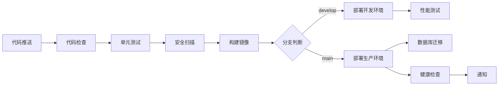

# CI/CD 运维指南

## 概述

本项目采用 **GitHub Actions** 实现完整的 CI/CD 流程，支持自动化测试、构建、部署和监控。

## CI/CD 流程图



## CI/CD 流程详解

### 1. 代码质量检查 (Lint and Format)

**触发条件**: 所有 Push 和 PR

**执行步骤**:
- ✅ **Black** - Python 代码格式化检查
- ✅ **isort** - 导入排序检查
- ✅ **flake8** - 代码风格检查
- ✅ **mypy** - 类型检查

**配置文件**: `.github/workflows/ci-cd.yml`

```yaml
lint-and-format:
  runs-on: ubuntu-latest
  steps:
    - Checkout code
    - Set up Python 3.11
    - Install linting tools
    - Run checks
```

### 2. 单元测试 (Test)

**触发条件**: 所有 Push 和 PR

**执行步骤**:
- ✅ 多 Python 版本测试（3.11, 3.12）
- ✅ 集成 PostgreSQL 和 Redis 服务
- ✅ 运行 pytest 测试套件
- ✅ 生成覆盖率报告
- ✅ 上传到 Codecov

**测试矩阵**:
- Python 3.11
- Python 3.12

**覆盖率要求**: > 80%

### 3. 安全扫描 (Security Scan)

**触发条件**: 所有 Push 和 PR

**执行步骤**:
- ✅ **Safety** - 依赖漏洞扫描
- ✅ **Bandit** - Python 代码安全扫描

**结果**: 生成安全报告并上传为 Artifact

### 4. 构建 Docker 镜像 (Build)

**触发条件**: 非 PR 的 Push

**执行步骤**:
- ✅ 使用 Docker Buildx 构建多平台镜像
- ✅ 推送到 GitHub Container Registry (ghcr.io)
- ✅ 使用缓存加速构建

**镜像标签策略**:
- 分支名: `main`, `develop`
- SHA: `main-abc123`
- 语义版本: `v1.0.0`, `v1.0`, `v1`
- 最新: `latest` (仅 main 分支)

**多平台支持**:
- `linux/amd64`
- `linux/arm64`

### 5. 部署到开发环境 (Deploy Dev)

**触发条件**: Push 到 `develop` 分支

**执行步骤**:
1. 配置 kubectl 和 Helm
2. 更新 Kubernetes Deployment
3. 等待滚动更新完成
4. 运行冒烟测试

**环境配置**:
- Namespace: `ceoagent-dev`
- URL: `https://dev-api.ceoagent.com`

### 6. 部署到生产环境 (Deploy Prod)

**触发条件**: Push 到 `main` 分支或标签 `v*`

**执行步骤**:
1. 创建部署备份
2. 更新 Kubernetes Deployment
3. 等待滚动更新（最长 5 分钟）
4. 运行冒烟测试
5. 失败时自动回滚
6. 发送部署通知

**环境配置**:
- Namespace: `ceoagent`
- URL: `https://api.ceoagent.com`

### 7. 数据库迁移 (Migrate)

**触发条件**: 生产环境部署成功后

**执行步骤**:
- 运行 Alembic 迁移
- 验证迁移状态

### 8. 性能测试 (Performance Test)

**触发条件**: 开发环境部署成功后

**执行步骤**:
- 使用 k6 进行负载测试
- 生成性能报告

## 环境配置

### GitHub Secrets 配置

需要在 GitHub 仓库的 Settings > Secrets 中配置以下密钥：

#### 必需 Secrets

```bash
# Docker Registry（自动使用 GITHUB_TOKEN）
# 无需配置

# Kubernetes 配置
KUBECONFIG_DEV          # 开发环境 kubeconfig（base64 编码）
KUBECONFIG_PROD         # 生产环境 kubeconfig（base64 编码）

# 应用密钥
ANTHROPIC_API_KEY       # Claude API 密钥
DATABASE_URL_PROD       # 生产环境数据库 URL

# 通知
SLACK_WEBHOOK           # Slack Webhook URL（可选）
```

### 生成 KUBECONFIG Secret

```bash
# 导出开发环境 kubeconfig
kubectl config view --flatten --minify > kubeconfig-dev.yaml
cat kubeconfig-dev.yaml | base64 | pbcopy

# 将 base64 内容添加到 GitHub Secrets 的 KUBECONFIG_DEV
```

### Kubernetes 环境设置

#### 开发环境

```bash
# 创建命名空间
kubectl create namespace ceoagent-dev

# 创建 Secret
kubectl create secret generic ceoagent-secrets \
  --from-literal=database-url='postgresql://...' \
  --from-literal=anthropic-api-key='sk-ant-...' \
  --from-literal=encryption-key='...' \
  -n ceoagent-dev

# 应用配置
kubectl apply -f k8s/base/configmap.yaml -n ceoagent-dev
```

#### 生产环境

```bash
# 创建命名空间
kubectl create namespace ceoagent

# 创建 Secret（使用安全的方式）
kubectl create secret generic ceoagent-secrets \
  --from-literal=database-url='postgresql://...' \
  --from-literal=anthropic-api-key='sk-ant-...' \
  --from-literal=encryption-key='...' \
  -n ceoagent

# 应用配置
kubectl apply -f k8s/base/configmap.yaml -n ceoagent
```

## 手动部署

### 使用部署脚本

```bash
# 部署到开发环境
export NAMESPACE=ceoagent-dev
export ENVIRONMENT=development
export IMAGE_TAG=develop-abc123
./scripts/deploy.sh

# 部署到生产环境
export NAMESPACE=ceoagent
export ENVIRONMENT=production
export IMAGE_TAG=v1.0.0
./scripts/deploy.sh
```

### 使用 kubectl 直接部署

```bash
# 更新镜像
kubectl set image deployment/ceoagent-api \
  api=ghcr.io/OWNER/CEOAgent:v1.0.0 \
  -n ceoagent

# 查看部署状态
kubectl rollout status deployment/ceoagent-api -n ceoagent

# 回滚
kubectl rollout undo deployment/ceoagent-api -n ceoagent
```

## 部署策略

### 滚动更新 (Rolling Update)

**配置**:
- `maxSurge`: 1 (最多新增 1 个 Pod)
- `maxUnavailable`: 0 (确保服务不中断)

**优点**:
- 零停机部署
- 自动回滚能力
- 渐进式更新

### 蓝绿部署 (Blue-Green Deployment)

如需实现蓝绿部署，可以创建两个 Deployment：

```bash
# 部署新版本（绿色）
kubectl apply -f k8s/blue-green/green-deployment.yaml

# 切换流量
kubectl patch service ceoagent-api -p '{"spec":{"selector":{"version":"green"}}}'

# 验证后删除旧版本
kubectl delete deployment ceoagent-api-blue
```

### 金丝雀发布 (Canary Deployment)

使用 Flagger 实现金丝雀发布：

```yaml
apiVersion: flagger.app/v1beta1
kind: Canary
metadata:
  name: ceoagent-api
spec:
  targetRef:
    apiVersion: apps/v1
    kind: Deployment
    name: ceoagent-api
  service:
    port: 80
  canaryAnalysis:
    interval: 1m
    threshold: 5
    maxWeight: 50
    stepWeight: 10
    metrics:
    - name: request-success-rate
      threshold: 99
    - name: request-duration
      threshold: 500
```

## 监控和告警

### CI/CD 指标

- **构建成功率**: 目标 > 95%
- **部署时间**: 目标 < 10 分钟
- **测试执行时间**: 目标 < 5 分钟

### 部署后验证

1. **健康检查**
   ```bash
   curl https://api.ceoagent.com/health
   ```

2. **就绪检查**
   ```bash
   curl https://api.ceoagent.com/ready
   ```

3. **指标检查**
   ```bash
   curl https://api.ceoagent.com/metrics
   ```

### 告警通知

配置 Slack 或邮件通知，当以下情况发生时发送告警：

- 构建失败
- 部署失败
- 健康检查失败
- 性能测试失败

## 故障排查

### 常见问题

#### 1. 构建失败

**问题**: Docker 镜像构建失败

**排查**:
```bash
# 查看构建日志
gh run view <run-id> --log

# 本地测试构建
docker build -t ceoagent:test .
```

#### 2. 部署失败

**问题**: Kubernetes 部署超时

**排查**:
```bash
# 查看 Pod 状态
kubectl get pods -n ceoagent

# 查看 Pod 日志
kubectl logs -n ceoagent deployment/ceoagent-api

# 查看事件
kubectl get events -n ceoagent --sort-by='.lastTimestamp'
```

#### 3. 健康检查失败

**问题**: 部署后健康检查不通过

**排查**:
```bash
# 检查 Pod 健康状态
kubectl describe pod -n ceoagent -l app=ceoagent-api

# 手动执行健康检查
kubectl exec -n ceoagent deployment/ceoagent-api -- curl localhost:8000/health
```

### 回滚流程

#### 自动回滚

当部署失败时，CI/CD 流程会自动执行回滚：

```yaml
- name: Rollback on failure
  if: failure()
  run: |
    kubectl rollout undo deployment/ceoagent-api -n ceoagent
```

#### 手动回滚

```bash
# 查看部署历史
kubectl rollout history deployment/ceoagent-api -n ceoagent

# 回滚到上一个版本
kubectl rollout undo deployment/ceoagent-api -n ceoagent

# 回滚到指定版本
kubectl rollout undo deployment/ceoagent-api --to-revision=2 -n ceoagent
```

## 持续改进

### 性能优化

1. **构建缓存**
   - 使用 Docker layer caching
   - 使用 GitHub Actions cache

2. **并行执行**
   - 测试和构建并行运行
   - 多环境并行部署

3. **增量测试**
   - 仅测试变更的文件
   - 使用测试结果缓存

### 最佳实践

1. **小步提交**
   - 频繁提交代码
   - 快速反馈循环

2. **代码审查**
   - 所有代码必须经过 PR 审查
   - 至少一人批准才能合并

3. **版本管理**
   - 使用语义化版本号
   - 标签化发布

4. **文档更新**
   - 保持文档同步
   - 记录变更日志

## 参考文档

- [GitHub Actions 文档](https://docs.github.com/en/actions)
- [Kubernetes 部署策略](https://kubernetes.io/docs/concepts/workloads/controllers/deployment/)
- [Docker 最佳实践](https://docs.docker.com/develop/dev-best-practices/)
- [DEPLOYMENT.md](./DEPLOYMENT.md) - 部署架构指南
- [MONITORING.md](./MONITORING.md) - 监控指南
