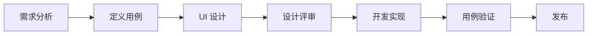

# UI 设计与用例验证快速指南

## 📚 文档概览

本文档集合为 **UI 设计师**、**产品经理**和**开发团队**提供完整的 UI 设计和用例验证指南，确保 CEOAgent 能够达到预期目标。

---

## 🎯 文档用途

### 1. UI_DESIGN_GUIDE.md - UI 设计指南

**面向：** UI/UX 设计师、前端开发工程师

**内容：**
- ✅ 用户研究与角色定义（用户画像、用户旅程）
- ✅ UI 设计方法论（设计流程、设计原则）
- ✅ 信息架构设计（功能模块、页面结构）
- ✅ 核心页面设计（决策中心、对话界面、结果展示）
- ✅ 视觉设计规范（颜色、字体、间距、组件）
- ✅ 交互设计规范（反馈机制、动效）
- ✅ 响应式设计（移动端适配）
- ✅ 可访问性设计（无障碍要求）
- ✅ 设计评审与测试方法

**何时使用：**
- 🔹 开始 UI 设计前，阅读用户研究和设计原则
- 🔹 设计页面时，参考核心页面设计规范
- 🔹 设计组件时，参考视觉设计规范
- 🔹 设计评审时，使用设计评审检查清单

**使用流程：**
```
1. 阅读用户研究与角色定义 → 理解目标用户
2. 阅读设计原则与方法论 → 确定设计方向
3. 参考信息架构 → 规划页面结构
4. 设计具体页面 → 参考核心页面设计
5. 使用设计规范 → 确保一致性
6. 进行设计评审 → 使用检查清单
```

---

### 2. USE_CASES.md - 用例定义与验证文档

**面向：** 产品经理、测试工程师、开发团队

**内容：**
- ✅ 用例分类体系（优先级、分类）
- ✅ 核心用例详细定义（用户故事、流程、验收标准）
- ✅ 测试场景（正常流程、异常流程、边界条件）
- ✅ 用例优先级矩阵
- ✅ 自动化测试用例示例
- ✅ 用例追踪与迭代

**何时使用：**
- 🔹 需求分析时，定义用例
- 🔹 开发前，明确验收标准
- 🔹 测试时，编写测试用例
- 🔹 验收时，验证是否达标

**使用流程：**
```
1. 确定用例 → 参考用例分类体系
2. 详细定义 → 使用用例模板
3. 编写测试 → 参考测试场景
4. 执行验证 → 使用验收标准
5. 追踪状态 → 记录用例状态
```

**核心用例速查：**
- **UC-001**: 快速决策分析 ⭐ P0
- **UC-005**: 自然语言对话 ⭐ P0
- **UC-004**: 风险评估 ⭐ P0
- **UC-003**: 多方案对比 ⭐ P1
- **UC-008**: 知识检索 ⭐ P1

---

### 3. VERIFICATION_CHECKLIST.md - 验证检查清单

**面向：** 项目管理者、QA 工程师、产品经理

**内容：**
- ✅ 验证框架（验证维度、验证方法）
- ✅ 项目目标验证（功能、性能、用户体验）
- ✅ 用例验证检查清单（每个用例的验证项）
- ✅ UI/UX 验证检查清单（设计原则、页面验证）
- ✅ 性能验证（响应时间、并发、可靠性）
- ✅ 安全验证（认证、数据安全、审计）
- ✅ 业务价值验证（决策质量、效率提升）
- ✅ 验证执行计划（开发阶段、发布前）
- ✅ 验证报告模板

**何时使用：**
- 🔹 设计评审时，检查 UI/UX
- 🔹 开发验收时，验证功能
- 🔹 发布前，全面检查
- 🔹 用户测试后，评估结果

**使用流程：**
```
1. 选择验证维度 → 功能/性能/UX/安全
2. 执行检查清单 → 逐项验证
3. 记录问题 → 使用问题清单
4. 生成报告 → 使用验证报告模板
5. 持续监控 → 上线后定期验证
```

---

## 🔄 文档协作流程

### 场景 1: 设计新功能



**具体步骤：**

1. **需求分析** → 阅读 `USE_CASES.md`，定义新用例
2. **UI 设计** → 参考 `UI_DESIGN_GUIDE.md`，设计界面
3. **设计评审** → 使用 `VERIFICATION_CHECKLIST.md` 中的 UI/UX 检查清单
4. **开发实现** → 开发完成后，执行用例测试
5. **用例验证** → 使用 `USE_CASES.md` 中的验收标准
6. **发布前检查** → 使用 `VERIFICATION_CHECKLIST.md` 进行全面验证

---

### 场景 2: 设计评审会议

**准备材料：**
1. UI 设计稿（Figma/Sketch）
2. `UI_DESIGN_GUIDE.md` - 设计规范
3. `VERIFICATION_CHECKLIST.md` - UI/UX 检查清单

**评审流程：**
```
1. 检查设计原则 → 效率优先、数据可视化、移动优先
2. 检查信息架构 → 功能模块划分是否合理
3. 检查核心页面 → 决策中心、对话界面、结果页
4. 检查视觉规范 → 颜色、字体、间距是否一致
5. 检查交互设计 → 反馈机制、动效是否合理
6. 检查响应式设计 → 移动端是否可用
7. 记录问题 → 使用问题清单
8. 确定改进方案 → 分配责任人
```

---

### 场景 3: 用例验收

**准备材料：**
1. `USE_CASES.md` - 用例定义
2. `VERIFICATION_CHECKLIST.md` - 验证检查清单
3. 测试环境、测试数据

**验收流程：**
```
1. 选择用例 → UC-001 快速决策分析
2. 阅读用例定义 → 用户故事、流程、验收标准
3. 执行测试场景 → 正常流程、异常流程、边界条件
4. 验证验收标准 → 功能性、性能、可用性
5. 记录结果 → 通过/未通过/需改进
6. 生成报告 → 使用验证报告模板
```

---

## 📋 快速检查清单

### MVP 发布前必做

#### 设计方面
- [ ] 所有核心页面设计完成（决策中心、对话界面、结果页）
- [ ] 设计规范文档完善（颜色、字体、组件）
- [ ] 设计评审通过（使用 UI/UX 检查清单）
- [ ] 移动端适配完成（响应式设计）

#### 用例方面
- [ ] 所有 P0 用例定义完成（UC-001, UC-005, UC-004）
- [ ] 用例测试场景编写完成
- [ ] 用例测试执行通过（≥ 95% 通过率）
- [ ] 用例验收标准明确

#### 验证方面
- [ ] 功能验证通过（所有 P0 用例）
- [ ] 性能验证通过（响应时间、并发）
- [ ] UI/UX 验证通过（可用性测试）
- [ ] 安全验证通过（安全审计）

---

## 🎓 最佳实践

### 1. 设计阶段

**DO ✅:**
- 先理解用户（阅读用户研究）
- 参考设计规范（保持一致性）
- 进行设计评审（多人评审）
- 制作交互原型（验证流程）

**DON'T ❌:**
- 直接开始设计（跳过用户研究）
- 忽略设计规范（各自为政）
- 只关注视觉效果（忽略可用性）
- 忽视移动端（只设计桌面端）

---

### 2. 用例定义阶段

**DO ✅:**
- 从用户视角定义用例（用户故事）
- 明确验收标准（可量化）
- 考虑异常流程（错误处理）
- 编写测试场景（具体可执行）

**DON'T ❌:**
- 从技术视角定义用例（避免技术细节）
- 验收标准模糊（如"好用"）
- 只考虑正常流程（忽略异常）
- 测试场景抽象（如"测试系统"）

---

### 3. 验证阶段

**DO ✅:**
- 使用检查清单（系统化验证）
- 记录问题（使用问题清单）
- 生成验证报告（可追溯）
- 持续监控（上线后）

**DON'T ❌:**
- 凭感觉验证（不系统）
- 只记录不修复（问题堆积）
- 发布后不监控（问题发现滞后）
- 忽略用户反馈（主观判断）

---

## 📖 文档更新说明

### 何时更新文档

- **UI_DESIGN_GUIDE.md**: 
  - 新增设计规范时
  - 修改设计原则时
  - 更新页面设计时

- **USE_CASES.md**:
  - 新增功能时（定义新用例）
  - 用例验收后（更新状态）
  - 发现新场景时（补充测试场景）

- **VERIFICATION_CHECKLIST.md**:
  - 发现新问题时（补充检查项）
  - 验证方法改进时（更新方法）
  - 指标调整时（更新标准）

### 更新流程

1. 提交 PR（Pull Request）
2. 团队评审
3. 合并到主分支
4. 通知相关团队

---

## 🤝 反馈与建议

如果发现文档问题或有改进建议，请：
1. 在文档中添加评论（如使用 Git 评论）
2. 提交 Issue 或 PR
3. 联系文档维护者

---

## 📚 相关资源

- [UI_DESIGN_GUIDE.md](./UI_DESIGN_GUIDE.md) - UI 设计完整指南
- [USE_CASES.md](./USE_CASES.md) - 用例定义文档
- [VERIFICATION_CHECKLIST.md](./VERIFICATION_CHECKLIST.md) - 验证检查清单
- [REQUIREMENTS.md](./REQUIREMENTS.md) - 需求文档
- [ARCHITECTURE.md](./ARCHITECTURE.md) - 架构文档

---

## 更新日志

- 2025-01-XX: 创建快速指南初版
- 待更新...