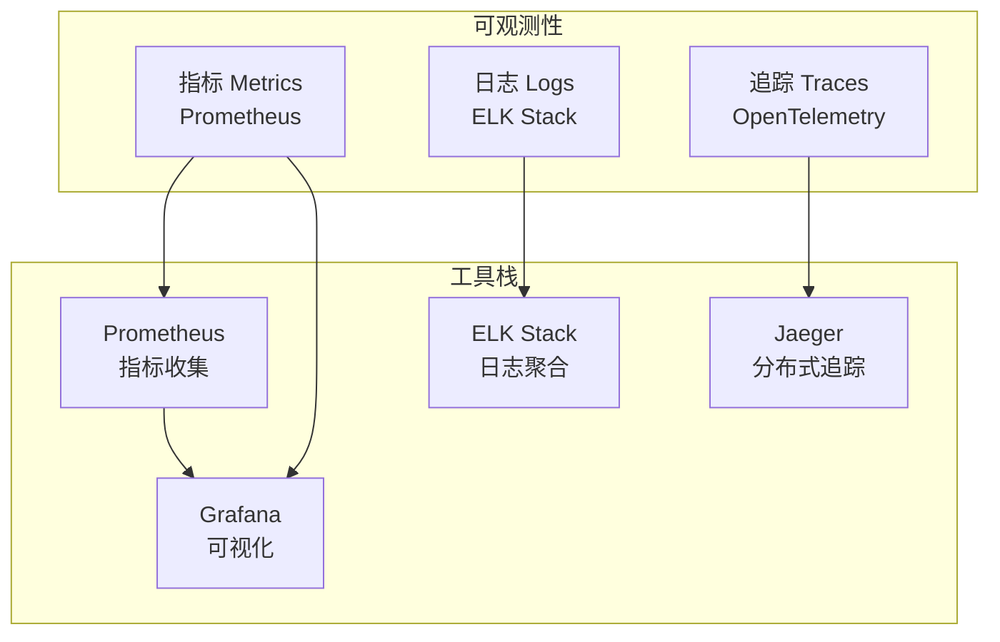

# 监控与可观测性指南

## 可观测性三大支柱



## 1. 指标监控 (Metrics)

### 1.1 Prometheus 指标

#### 系统指标

```python
from prometheus_client import Counter, Histogram, Gauge, Summary

# 请求计数
http_requests_total = Counter(
    'http_requests_total',
    'Total HTTP requests',
    ['method', 'endpoint', 'status']
)

# 请求延迟
http_request_duration_seconds = Histogram(
    'http_request_duration_seconds',
    'HTTP request duration',
    ['method', 'endpoint'],
    buckets=[0.1, 0.5, 1.0, 2.0, 5.0, 10.0]
)

# 活跃连接数
active_connections = Gauge(
    'active_connections',
    'Number of active connections'
)

# Agent 执行时间
agent_execution_duration_seconds = Summary(
    'agent_execution_duration_seconds',
    'Agent execution duration',
    ['agent_type', 'status']
)
```

#### 业务指标

```python
# 决策相关
decisions_total = Counter(
    'decisions_total',
    'Total number of decisions',
    ['user_id', 'decision_type', 'status']
)

decision_confidence = Histogram(
    'decision_confidence',
    'Decision confidence score',
    buckets=[0.0, 0.5, 0.6, 0.7, 0.8, 0.9, 1.0]
)

# Skill 相关
skill_executions_total = Counter(
    'skill_executions_total',
    'Total skill executions',
    ['skill_name', 'status']
)

skill_execution_duration_seconds = Histogram(
    'skill_execution_duration_seconds',
    'Skill execution duration',
    ['skill_name']
)

# LLM 相关
llm_requests_total = Counter(
    'llm_requests_total',
    'Total LLM API requests',
    ['model', 'status']
)

llm_tokens_total = Counter(
    'llm_tokens_total',
    'Total LLM tokens used',
    ['model', 'type']  # type: input/output
)

llm_request_duration_seconds = Histogram(
    'llm_request_duration_seconds',
    'LLM API request duration',
    ['model']
)
```

### 1.2 FastAPI 集成

```python
from prometheus_client import generate_latest, CONTENT_TYPE_LATEST
from fastapi import Response
from starlette.middleware.base import BaseHTTPMiddleware
import time

class PrometheusMiddleware(BaseHTTPMiddleware):
    """Prometheus 指标中间件"""
    
    async def dispatch(self, request, call_next):
        start_time = time.time()
        
        response = await call_next(request)
        
        # 记录请求指标
        duration = time.time() - start_time
        http_requests_total.labels(
            method=request.method,
            endpoint=request.url.path,
            status=response.status_code
        ).inc()
        
        http_request_duration_seconds.labels(
            method=request.method,
            endpoint=request.url.path
        ).observe(duration)
        
        return response

# 添加指标端点
@app.get("/metrics")
async def metrics():
    return Response(
        content=generate_latest(),
        media_type=CONTENT_TYPE_LATEST
    )
```

### 1.3 Grafana 仪表板

**关键仪表板**：

1. **系统概览**
   - CPU、内存使用率
   - 请求速率
   - 错误率
   - 响应时间

2. **业务指标**
   - 决策数量趋势
   - Skill 调用分布
   - LLM Token 使用
   - 用户活跃度

3. **Agent 性能**
   - Agent 执行时间
   - Skill 执行时间分布
   - 并发请求数
   - 队列深度

4. **LLM 指标**
   - API 调用频率
   - Token 使用量
   - 响应时间
   - 错误率

## 2. 日志聚合 (Logging)

### 2.1 日志级别

```python
import logging

# 配置日志
logging.basicConfig(
    level=logging.INFO,
    format='%(asctime)s - %(name)s - %(levelname)s - %(message)s'
)

logger = logging.getLogger(__name__)

# 结构化日志
import structlog

logger = structlog.get_logger()
logger.info(
    "decision_created",
    decision_id="uuid",
    user_id="user-uuid",
    query="Should we expand?",
    execution_time_ms=1234
)
```

### 2.2 ELK Stack 配置

#### Logstash 配置

```ruby
input {
  beats {
    port => 5044
  }
}

filter {
  json {
    source => "message"
  }
  
  date {
    match => [ "timestamp", "ISO8601" ]
  }
  
  # 提取日志字段
  grok {
    match => { "message" => "%{TIMESTAMP_ISO8601:timestamp} %{LOGLEVEL:level} %{GREEDYDATA:message}" }
  }
}

output {
  elasticsearch {
    hosts => ["elasticsearch:9200"]
    index => "ceoagent-logs-%{+YYYY.MM.dd}"
  }
}
```

### 2.3 日志格式

**结构化日志示例**：

```json
{
  "timestamp": "2025-01-11T10:00:00Z",
  "level": "INFO",
  "service": "ceoagent-api",
  "request_id": "req-uuid",
  "user_id": "user-uuid",
  "message": "Decision created",
  "decision_id": "decision-uuid",
  "execution_time_ms": 1234,
  "skills_used": ["data_analysis", "risk_assessment"]
}
```

## 3. 分布式追踪 (Tracing)

### 3.1 OpenTelemetry 集成

```python
from opentelemetry import trace
from opentelemetry.exporter.otlp.proto.grpc.trace_exporter import OTLPSpanExporter
from opentelemetry.sdk.trace import TracerProvider
from opentelemetry.sdk.trace.export import BatchSpanProcessor
from opentelemetry.instrumentation.fastapi import FastAPIInstrumentor
from opentelemetry.instrumentation.httpx import HTTPXClientInstrumentor

# 初始化追踪
trace.set_tracer_provider(TracerProvider())
tracer = trace.get_tracer(__name__)

# 配置导出器
otlp_exporter = OTLPSpanExporter(
    endpoint="http://jaeger:4317",
    insecure=True
)

span_processor = BatchSpanProcessor(otlp_exporter)
trace.get_tracer_provider().add_span_processor(span_processor)

# 自动注入 FastAPI
FastAPIInstrumentor.instrument_app(app)
HTTPXClientInstrumentor.instrument()
```

### 3.2 手动追踪

```python
from opentelemetry import trace

tracer = trace.get_tracer(__name__)

async def analyze_decision(query: str):
    """带追踪的决策分析"""
    with tracer.start_as_current_span("analyze_decision") as span:
        span.set_attribute("query", query)
        
        # 执行 Skill
        with tracer.start_as_current_span("execute_skill") as skill_span:
            skill_span.set_attribute("skill.name", "data_analysis")
            result = await skill_executor.execute("data_analysis", params)
            skill_span.set_attribute("skill.success", result.success)
        
        # 调用 LLM
        with tracer.start_as_current_span("llm_call") as llm_span:
            llm_span.set_attribute("llm.model", "claude-3-5-sonnet")
            response = await claude_client.call(prompt)
            llm_span.set_attribute("llm.tokens", response.usage.total_tokens)
        
        return result
```

## 4. Agent 行为监控

### 4.1 Agent 执行追踪

```python
class AgentMonitor:
    """Agent 行为监控"""
    
    async def track_agent_execution(
        self,
        agent_type: str,
        query: str,
        execution_time: float,
        skills_used: List[str],
        success: bool
    ):
        """追踪 Agent 执行"""
        # 记录指标
        agent_executions_total.labels(
            agent_type=agent_type,
            status="success" if success else "failure"
        ).inc()
        
        agent_execution_duration_seconds.labels(
            agent_type=agent_type,
            status="success" if success else "failure"
        ).observe(execution_time)
        
        # 记录日志
        logger.info(
            "agent_execution",
            agent_type=agent_type,
            query=query,
            execution_time_ms=execution_time * 1000,
            skills_used=skills_used,
            success=success
        )
```

### 4.2 Skill 使用分析

```python
async def track_skill_usage(skill_name: str, duration: float, success: bool):
    """追踪 Skill 使用"""
    skill_executions_total.labels(
        skill_name=skill_name,
        status="success" if success else "failure"
    ).inc()
    
    skill_execution_duration_seconds.labels(
        skill_name=skill_name
    ).observe(duration)
```

## 5. 告警规则

### 5.1 Prometheus 告警规则

```yaml
groups:
- name: ceoagent_alerts
  interval: 30s
  rules:
  # 高错误率告警
  - alert: HighErrorRate
    expr: rate(http_requests_total{status=~"5.."}[5m]) > 0.1
    for: 5m
    labels:
      severity: critical
    annotations:
      summary: "High error rate detected"
      description: "Error rate is {{ $value }} per second"

  # 响应时间告警
  - alert: HighResponseTime
    expr: histogram_quantile(0.95, http_request_duration_seconds) > 1.0
    for: 5m
    labels:
      severity: warning
    annotations:
      summary: "High response time"
      description: "P95 response time is {{ $value }} seconds"

  # LLM API 失败告警
  - alert: LLMAPIFailure
    expr: rate(llm_requests_total{status="error"}[5m]) > 0.05
    for: 2m
    labels:
      severity: critical
    annotations:
      summary: "LLM API failures detected"
      description: "LLM API error rate is {{ $value }}"

  # 数据库连接告警
  - alert: DatabaseConnectionFailure
    expr: up{job="postgres"} == 0
    for: 1m
    labels:
      severity: critical
    annotations:
      summary: "Database connection failed"
      description: "PostgreSQL is down"

  # Token 使用告警
  - alert: HighTokenUsage
    expr: rate(llm_tokens_total[1h]) > 100000
    for: 10m
    labels:
      severity: warning
    annotations:
      summary: "High LLM token usage"
      description: "Token usage rate is {{ $value }} per hour"
```

### 5.2 Alertmanager 配置

```yaml
global:
  resolve_timeout: 5m

route:
  group_by: ['alertname', 'severity']
  group_wait: 10s
  group_interval: 10s
  repeat_interval: 12h
  receiver: 'default'
  routes:
  - match:
      severity: critical
    receiver: 'critical-alerts'
  - match:
      severity: warning
    receiver: 'warning-alerts'

receivers:
- name: 'default'
  slack_configs:
  - api_url: 'https://hooks.slack.com/services/...'
    channel: '#ceoagent-alerts'
    title: 'CEOAgent Alert'

- name: 'critical-alerts'
  slack_configs:
  - api_url: 'https://hooks.slack.com/services/...'
    channel: '#ceoagent-critical'
    title: 'CRITICAL: CEOAgent Alert'
  email_configs:
  - to: 'oncall@ceoagent.com'
    from: 'alerts@ceoagent.com'
```

## 6. 性能分析

### 6.1 APM (Application Performance Monitoring)

**使用工具**：
- New Relic
- Datadog APM
- Elastic APM

### 6.2 性能分析示例

```python
import cProfile
import pstats
import io

class PerformanceProfiler:
    """性能分析器"""
    
    def __init__(self):
        self.profiler = cProfile.Profile()
    
    def start(self):
        self.profiler.enable()
    
    def stop(self):
        self.profiler.disable()
    
    def get_stats(self, top_n: int = 20) -> str:
        """获取性能统计"""
        s = io.StringIO()
        ps = pstats.Stats(self.profiler, stream=s)
        ps.sort_stats('cumulative')
        ps.print_stats(top_n)
        return s.getvalue()

# 使用示例
profiler = PerformanceProfiler()
profiler.start()

# 执行代码
await analyze_decision(query)

profiler.stop()
stats = profiler.get_stats()
logger.debug("performance_stats", stats=stats)
```

## 7. 监控仪表板

### 7.1 Grafana 仪表板配置

**关键图表**：

1. **请求速率**
   ```
   rate(http_requests_total[5m])
   ```

2. **错误率**
   ```
   rate(http_requests_total{status=~"5.."}[5m]) / 
   rate(http_requests_total[5m])
   ```

3. **P95 响应时间**
   ```
   histogram_quantile(0.95, http_request_duration_seconds)
   ```

4. **Token 使用量**
   ```
   sum(rate(llm_tokens_total[1h])) by (type)
   ```

5. **Skill 调用分布**
   ```
   sum(rate(skill_executions_total[5m])) by (skill_name)
   ```

## 8. 日志查询

### 8.1 Kibana 查询示例

**查找错误日志**：
```
level:ERROR AND service:ceoagent-api
```

**查找特定用户的决策**：
```
user_id:"user-uuid" AND message:"decision_created"
```

**查找执行时间超过阈值的请求**：
```
execution_time_ms:>5000
```

## 9. 监控清单

### 日常监控

- [ ] 检查错误率
- [ ] 查看响应时间趋势
- [ ] 监控资源使用
- [ ] 检查告警状态

### 定期审查

- [ ] 性能趋势分析
- [ ] 容量规划
- [ ] 告警规则优化
- [ ] 日志保留策略

## 10. 最佳实践

### 1. 指标命名规范

- 使用小写字母和下划线
- 包含单位（如 `_seconds`, `_bytes`, `_total`）
- 使用描述性的名称

### 2. 日志结构化

- 使用 JSON 格式
- 包含必要的上下文信息
- 避免敏感信息

### 3. 追踪采样

- 生产环境使用采样（如 1%）
- 错误请求 100% 追踪
- 慢请求 100% 追踪

### 4. 告警疲劳

- 避免过于频繁的告警
- 告警应该有明确的行动项
- 定期审查和优化告警规则

## 参考文档

- [ARCHITECTURE.md](./ARCHITECTURE.md) - 系统架构
- [PERFORMANCE.md](./PERFORMANCE.md) - 性能优化
- [DEPLOYMENT.md](./DEPLOYMENT.md) - 部署指南
- [Prometheus 文档](https://prometheus.io/docs/)
- [OpenTelemetry 文档](https://opentelemetry.io/docs/)
