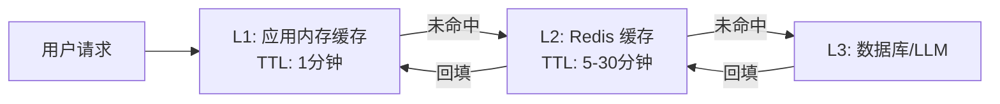

# 性能优化指南

## 性能目标

### 关键性能指标（KPI）

- **API 响应时间**：P95 < 500ms，P99 < 1s
- **Agent 执行时间**：平均 < 2s，P95 < 5s
- **并发处理能力**：支持 1000+ 并发请求
- **数据库查询**：P95 < 100ms
- **向量检索**：P95 < 200ms
- **LLM API 调用**：P95 < 3s

## 1. 缓存策略

### 1.1 多级缓存架构



### 1.2 Skill 结果缓存

```python
from typing import Optional, Any
import hashlib
import json
import redis.asyncio as redis

class SkillCache:
    """Skill 结果缓存"""
    
    def __init__(self, redis_client: redis.Redis):
        self.redis = redis_client
        self.default_ttl = 300  # 5 分钟
    
    def _generate_cache_key(
        self,
        skill_name: str,
        params: Dict[str, Any]
    ) -> str:
        """生成缓存键"""
        # 规范化参数（排序、去除 None）
        normalized_params = json.dumps(params, sort_keys=True, default=str)
        param_hash = hashlib.md5(normalized_params.encode()).hexdigest()
        return f"skill:{skill_name}:{param_hash}"
    
    async def get(
        self,
        skill_name: str,
        params: Dict[str, Any]
    ) -> Optional[Any]:
        """获取缓存结果"""
        key = self._generate_cache_key(skill_name, params)
        data = await self.redis.get(key)
        if data:
            return json.loads(data)
        return None
    
    async def set(
        self,
        skill_name: str,
        params: Dict[str, Any],
        result: Any,
        ttl: Optional[int] = None
    ) -> None:
        """设置缓存"""
        key = self._generate_cache_key(skill_name, params)
        ttl = ttl or self.default_ttl
        await self.redis.setex(
            key,
            ttl,
            json.dumps(result, default=str)
        )

# 在 Skill Executor 中使用
class CachedSkillExecutor(SkillExecutor):
    """带缓存的 Skill 执行器"""
    
    def __init__(self, registry: SkillRegistry, cache: SkillCache):
        super().__init__(registry)
        self.cache = cache
    
    async def execute(
        self,
        skill_name: str,
        params: Dict[str, Any]
    ) -> SkillResult:
        # 1. 检查缓存
        cached_result = await self.cache.get(skill_name, params)
        if cached_result:
            return SkillResult(**cached_result)
        
        # 2. 执行 Skill
        result = await super().execute(skill_name, params)
        
        # 3. 缓存结果（仅成功的结果）
        if result.success:
            await self.cache.set(skill_name, params, result.dict())
        
        return result
```

### 1.3 LLM 响应缓存

```python
class LLMCache:
    """LLM 响应缓存（基于语义相似度）"""
    
    def __init__(self, redis_client: redis.Redis, embedding_client):
        self.redis = redis_client
        self.embedding_client = embedding_client
        self.similarity_threshold = 0.95  # 相似度阈值
    
    async def get_similar_response(
        self,
        query: str,
        context: Optional[Dict] = None
    ) -> Optional[Dict]:
        """获取相似的缓存响应"""
        # 1. 生成查询向量
        query_embedding = await self._generate_embedding(query, context)
        
        # 2. 在缓存中搜索相似查询（使用向量相似度）
        # 这里简化处理，实际可以使用 Redis 的向量搜索或 Weaviate
        cache_key = f"llm:cache:{hashlib.md5(query.encode()).hexdigest()}"
        cached = await self.redis.get(cache_key)
        if cached:
            cached_data = json.loads(cached)
            # 验证相似度
            similarity = self._cosine_similarity(
                query_embedding,
                cached_data["embedding"]
            )
            if similarity >= self.similarity_threshold:
                return cached_data["response"]
        
        return None
    
    async def cache_response(
        self,
        query: str,
        response: str,
        context: Optional[Dict] = None
    ) -> None:
        """缓存响应"""
        embedding = await self._generate_embedding(query, context)
        cache_key = f"llm:cache:{hashlib.md5(query.encode()).hexdigest()}"
        
        cache_data = {
            "query": query,
            "response": response,
            "embedding": embedding,
            "timestamp": datetime.utcnow().isoformat()
        }
        
        await self.redis.setex(
            cache_key,
            3600,  # 1 小时 TTL
            json.dumps(cache_data, default=str)
        )
```

### 1.4 向量检索缓存

```python
class VectorCache:
    """向量检索缓存"""
    
    async def get_cached_retrieval(
        self,
        query: str,
        limit: int
    ) -> Optional[List[Dict]]:
        """获取缓存的检索结果"""
        cache_key = f"vector:retrieval:{hashlib.md5(query.encode()).hexdigest()}:{limit}"
        cached = await self.redis.get(cache_key)
        if cached:
            return json.loads(cached)
        return None
    
    async def cache_retrieval(
        self,
        query: str,
        limit: int,
        results: List[Dict]
    ) -> None:
        """缓存检索结果"""
        cache_key = f"vector:retrieval:{hashlib.md5(query.encode()).hexdigest()}:{limit}"
        await self.redis.setex(
            cache_key,
            1800,  # 30 分钟 TTL
            json.dumps(results, default=str)
        )
```

## 2. 异步处理优化

### 2.1 异步 I/O

**原则**：所有 I/O 操作必须异步化

```python
# 正确：使用异步数据库客户端
import asyncpg

async def get_decision(decision_id: str, pool: asyncpg.Pool):
    async with pool.acquire() as conn:
        return await conn.fetchrow(
            "SELECT * FROM decisions WHERE decision_id = $1",
            decision_id
        )

# 错误：使用同步数据库客户端（阻塞）
import psycopg2

def get_decision_sync(decision_id: str, conn: psycopg2.connection):
    cursor = conn.cursor()
    cursor.execute("SELECT * FROM decisions WHERE decision_id = %s", (decision_id,))
    return cursor.fetchone()  # 阻塞！
```

### 2.2 并发执行

**并行执行独立的 Skills**：

```python
import asyncio

async def execute_skills_parallel(
    executor: SkillExecutor,
    skills: List[Dict[str, Any]]
) -> Dict[str, SkillResult]:
    """并行执行多个独立的 Skills"""
    # 创建并发任务
    tasks = [
        executor.execute(skill["name"], skill["params"])
        for skill in skills
    ]
    
    # 并发执行
    results = await asyncio.gather(*tasks, return_exceptions=True)
    
    # 处理结果
    skill_results = {}
    for skill, result in zip(skills, results):
        if isinstance(result, Exception):
            skill_results[skill["name"]] = SkillResult(
                success=False,
                error=str(result)
            )
        else:
            skill_results[skill["name"]] = result
    
    return skill_results
```

**批量数据库操作**：

```python
async def batch_insert_decisions(
    pool: asyncpg.Pool,
    decisions: List[Dict]
) -> None:
    """批量插入决策记录"""
    async with pool.acquire() as conn:
        # 使用 executemany 批量插入
        await conn.executemany(
            """
            INSERT INTO decisions (decision_id, user_id, query, result)
            VALUES ($1, $2, $3, $4)
            """,
            [
                (d["decision_id"], d["user_id"], d["query"], d["result"])
                for d in decisions
            ]
        )
```

### 2.3 异步任务队列

**耗时任务异步处理**：

```python
from celery import Celery

celery_app = Celery(
    'ceo_agent',
    broker='redis://localhost:6379/0',
    backend='redis://localhost:6379/0'
)

@celery_app.task
async def process_long_running_analysis(analysis_id: str):
    """长时间运行的分析任务"""
    # 耗时的数据分析
    result = await perform_complex_analysis(analysis_id)
    return result

# API 端点：异步提交任务
@router.post("/api/v1/analysis/start")
async def start_analysis(request: AnalysisRequest):
    task = process_long_running_analysis.delay(request.analysis_id)
    return {"task_id": task.id, "status": "processing"}

# 查询任务状态
@router.get("/api/v1/analysis/{task_id}/status")
async def get_analysis_status(task_id: str):
    task = celery_app.AsyncResult(task_id)
    return {
        "task_id": task_id,
        "status": task.status,
        "result": task.result if task.ready() else None
    }
```

## 3. 数据库优化

### 3.1 连接池

```python
import asyncpg

class DatabasePool:
    """数据库连接池"""
    
    def __init__(self):
        self.pool: Optional[asyncpg.Pool] = None
    
    async def initialize(self):
        """初始化连接池"""
        self.pool = await asyncpg.create_pool(
            host="localhost",
            port=5432,
            user="ceo_agent",
            password="password",
            database="ceo_agent",
            min_size=10,      # 最小连接数
            max_size=50,      # 最大连接数
            max_queries=50000,  # 每个连接最大查询数
            max_inactive_connection_lifetime=300.0  # 空闲连接超时
        )
    
    async def close(self):
        """关闭连接池"""
        if self.pool:
            await self.pool.close()
```

### 3.2 查询优化

**索引优化**：
```sql
-- 为常用查询字段创建索引
CREATE INDEX idx_decisions_user_id ON decisions(user_id);
CREATE INDEX idx_decisions_created_at ON decisions(created_at);
CREATE INDEX idx_decisions_user_created ON decisions(user_id, created_at);

-- 复合索引用于复杂查询
CREATE INDEX idx_decisions_query ON decisions USING gin(to_tsvector('english', query));
```

**查询优化**：
```python
# 使用 EXPLAIN 分析查询性能
async def optimize_query(conn: asyncpg.Connection):
    plan = await conn.fetch("""
        EXPLAIN ANALYZE
        SELECT * FROM decisions
        WHERE user_id = $1
        ORDER BY created_at DESC
        LIMIT 10
    """, user_id)
    return plan

# 使用分页避免大量数据加载
async def get_decisions_paginated(
    pool: asyncpg.Pool,
    user_id: str,
    page: int = 1,
    page_size: int = 20
):
    offset = (page - 1) * page_size
    async with pool.acquire() as conn:
        return await conn.fetch("""
            SELECT * FROM decisions
            WHERE user_id = $1
            ORDER BY created_at DESC
            LIMIT $2 OFFSET $3
        """, user_id, page_size, offset)
```

### 3.3 数据库分片（未来扩展）

```python
class ShardedDatabase:
    """分片数据库管理器"""
    
    def __init__(self, shards: List[asyncpg.Pool]):
        self.shards = shards
    
    def get_shard(self, key: str) -> asyncpg.Pool:
        """根据键选择分片"""
        shard_index = hash(key) % len(self.shards)
        return self.shards[shard_index]
    
    async def get_decision(self, decision_id: str):
        """从正确的分片获取数据"""
        shard = self.get_shard(decision_id)
        async with shard.acquire() as conn:
            return await conn.fetchrow(
                "SELECT * FROM decisions WHERE decision_id = $1",
                decision_id
            )
```

## 4. LLM API 优化

### 4.1 请求批处理

```python
async def batch_llm_requests(
    client: Anthropic,
    requests: List[Dict[str, Any]]
) -> List[str]:
    """批量处理 LLM 请求（如果 API 支持）"""
    # 注意：需要检查 Claude API 是否支持批处理
    # 如果不支持，使用并发请求
    tasks = [
        client.messages.create(**req)
        for req in requests
    ]
    responses = await asyncio.gather(*tasks)
    return [resp.content[0].text for resp in responses]
```

### 4.2 Token 使用优化

```python
class TokenOptimizer:
    """Token 使用优化"""
    
    @staticmethod
    def truncate_context(
        messages: List[Dict],
        max_tokens: int
    ) -> List[Dict]:
        """截断上下文以节省 Token"""
        # 保留系统消息和最近的对话
        truncated = []
        token_count = 0
        
        for msg in reversed(messages):
            msg_tokens = estimate_tokens(msg["content"])
            if token_count + msg_tokens <= max_tokens:
                truncated.insert(0, msg)
                token_count += msg_tokens
            else:
                break
        
        return truncated
    
    @staticmethod
    def summarize_old_messages(
        old_messages: List[Dict]
    ) -> str:
        """总结旧消息以节省 Token"""
        # 使用 LLM 总结旧对话
        summary_prompt = f"""
        请总结以下对话历史的关键信息：
        {json.dumps(old_messages, ensure_ascii=False)}
        """
        # 调用 LLM 生成总结
        return summary
```

### 4.3 流式响应

```python
async def stream_llm_response(
    client: Anthropic,
    prompt: str
):
    """流式返回 LLM 响应"""
    async with client.messages.stream(
        model="claude-3-5-sonnet-20241022",
        max_tokens=1024,
        messages=[{"role": "user", "content": prompt}]
    ) as stream:
        async for text in stream.text_stream:
            yield text
```

## 5. 向量数据库优化

### 5.1 批量向量化

```python
async def batch_embed(
    client: Anthropic,
    texts: List[str],
    batch_size: int = 100
) -> List[List[float]]:
    """批量生成向量嵌入"""
    embeddings = []
    for i in range(0, len(texts), batch_size):
        batch = texts[i:i + batch_size]
        batch_embeddings = await client.embeddings.create(
            model="text-embedding-3-large",
            input=batch
        )
        embeddings.extend([emb.data[0].embedding for emb in batch_embeddings])
    return embeddings
```

### 5.2 向量检索优化

```python
class OptimizedVectorRetrieval:
    """优化的向量检索"""
    
    async def hybrid_search(
        self,
        query: str,
        query_vector: List[float],
        limit: int = 10
    ) -> List[Dict]:
        """混合搜索（向量 + 关键词）"""
        # Weaviate 支持混合搜索
        results = await self.weaviate.query.get(
            class_name="Decision",
            limit=limit
        ).with_hybrid(
            query=query,
            vector=query_vector,
            alpha=0.7  # 0.7 向量，0.3 关键词
        ).do()
        
        return results.get("data", {}).get("Get", {}).get("Decision", [])
    
    async def rerank_results(
        self,
        query: str,
        results: List[Dict],
        top_k: int = 5
    ) -> List[Dict]:
        """使用重排序提升检索质量"""
        # 使用交叉编码器重排序（如果可用）
        # 或者使用简单的相关性评分
        scored_results = [
            {
                **result,
                "relevance_score": self._calculate_relevance(query, result)
            }
            for result in results
        ]
        scored_results.sort(key=lambda x: x["relevance_score"], reverse=True)
        return scored_results[:top_k]
```

## 6. 性能监控

### 6.1 性能指标收集

```python
from prometheus_client import Counter, Histogram, Gauge

# 定义指标
request_duration = Histogram(
    'api_request_duration_seconds',
    'API request duration',
    ['method', 'endpoint']
)

skill_execution_time = Histogram(
    'skill_execution_seconds',
    'Skill execution time',
    ['skill_name']
)

llm_token_usage = Counter(
    'llm_tokens_total',
    'Total LLM tokens used',
    ['model', 'type']  # type: input/output
)

active_requests = Gauge(
    'active_requests',
    'Number of active requests'
)

# 使用装饰器自动收集指标
def track_performance(func):
    @wraps(func)
    async def wrapper(*args, **kwargs):
        endpoint = f"{func.__name__}"
        active_requests.inc()
        
        with request_duration.labels(
            method="POST",
            endpoint=endpoint
        ).time():
            result = await func(*args, **kwargs)
        
        active_requests.dec()
        return result
    return wrapper
```

### 6.2 性能分析

```python
import cProfile
import pstats
import io

class PerformanceProfiler:
    """性能分析器"""
    
    def __init__(self):
        self.profiler = cProfile.Profile()
    
    def start(self):
        self.profiler.enable()
    
    def stop(self):
        self.profiler.disable()
    
    def get_stats(self) -> str:
        """获取性能统计"""
        s = io.StringIO()
        ps = pstats.Stats(self.profiler, stream=s)
        ps.sort_stats('cumulative')
        ps.print_stats(20)  # 打印前 20 个最耗时的函数
        return s.getvalue()
```

## 7. 负载测试

### 7.1 使用 Locust 进行负载测试

```python
from locust import HttpUser, task, between

class CEOAgentUser(HttpUser):
    wait_time = between(1, 3)
    
    def on_start(self):
        """登录获取 Token"""
        response = self.client.post("/api/v1/auth/login", json={
            "email": "test@example.com",
            "password": "password"
        })
        self.token = response.json()["access_token"]
        self.headers = {"Authorization": f"Bearer {self.token}"}
    
    @task(3)
    def analyze_decision(self):
        """决策分析（高频任务）"""
        self.client.post(
            "/api/v1/decision/analyze",
            json={"query": "Should we expand to new markets?"},
            headers=self.headers
        )
    
    @task(1)
    def get_decisions(self):
        """获取决策列表（低频任务）"""
        self.client.get(
            "/api/v1/decisions",
            headers=self.headers
        )
```

## 8. 性能优化清单

### 必须实施（P0）

- [ ] 实现多级缓存（应用内存 + Redis）
- [ ] 所有 I/O 操作异步化
- [ ] 数据库连接池优化
- [ ] API 限流实施
- [ ] 基础性能监控

### 应该实施（P1）

- [ ] LLM 响应缓存
- [ ] 向量检索缓存
- [ ] 批量数据库操作
- [ ] 并发 Skill 执行
- [ ] 流式响应支持

### 可以实施（P2）

- [ ] 数据库分片
- [ ] 异步任务队列
- [ ] Token 使用优化
- [ ] 高级性能分析
- [ ] 自动扩缩容

## 参考文档

- [ARCHITECTURE.md](./ARCHITECTURE.md) - 系统架构
- [MONITORING.md](./MONITORING.md) - 监控指南
- [DEPLOYMENT.md](./DEPLOYMENT.md) - 部署指南
