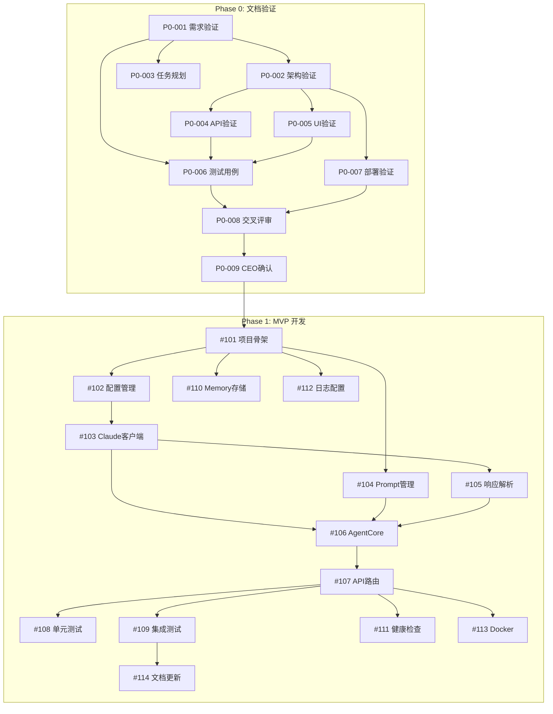

# Task Board

任务协调看板 - 所有 Agent 通过此文件协调工作

> **更新日期**: 2026-01-12
> **更新人**: 开发经理 (Dev Manager)

## 状态说明
- `[TODO]` - 待开始
- `[IN-PROGRESS]` - 进行中 (标注负责 Agent)
- `[BLOCKED]` - 被阻塞 (需要 CEO 决策)
- `[DONE]` - 开发完成，待 QA 验证
- `[VERIFIED]` - QA 验证通过
- `[CLOSED]` - CEO 确认关闭

---

## 当前阶段: Phase 0 - 文档验证

### Phase 0 任务清单

| 任务ID | 任务 | 负责人 | 依赖 | 状态 |
|--------|------|--------|------|------|
| P0-001 | 需求验证与追踪矩阵 | PM | - | ✅ DONE |
| P0-002 | 架构验证报告 | Architect | P0-001 | ✅ DONE |
| P0-003 | 任务分解与规划 | DevMgr | P0-001 | 🔄 IN-PROGRESS |
| P0-004 | API 设计验证 | Backend | P0-002 | ⏳ TODO |
| P0-005 | UI 设计验证 | Frontend | P0-002 | ⏳ TODO |
| P0-006 | 测试用例设计 | QA | P0-001,P0-004,P0-005 | ⏳ TODO |
| P0-007 | 部署方案验证 | DevOps | P0-002 | ⏳ TODO |
| P0-008 | 交叉评审 | 全员 | P0-006,P0-007 | ⏳ TODO |
| P0-009 | CEO 确认 | CEO | P0-008 | ⏳ TODO |

---

## Phase 1 任务规划

### 高优先级 (P0)

- [TODO] #101 项目骨架搭建
  - 描述: 创建项目目录结构，配置开发环境
  - 负责人: Backend
  - 设计文档: MASTER_PLAN.md 第四章
  - 验收标准:
    1. 项目结构符合 MASTER_PLAN 定义
    2. pyproject.toml 配置完成
    3. 开发环境可正常运行
  - 预估工时: 0.5 天

- [TODO] #102 配置管理模块
  - 描述: 实现配置加载、环境变量管理
  - 负责人: Backend
  - 依赖: #101
  - 验收标准:
    1. 支持 .env 文件加载
    2. Pydantic Settings 验证
    3. 敏感配置不硬编码
  - 预估工时: 0.5 天

- [TODO] #103 Claude API 客户端
  - 描述: 封装 Anthropic Claude API 调用
  - 负责人: Backend
  - 依赖: #102
  - 设计文档: MASTER_PLAN.md
  - 验收标准:
    1. 支持异步调用
    2. 超时和重试机制
    3. Token 统计
    4. 错误处理
  - 预估工时: 1 天

- [TODO] #104 Prompt 管理器
  - 描述: 管理 Prompt 模板，支持变量替换
  - 负责人: Backend
  - 依赖: #101
  - 验收标准:
    1. 加载 prompts/v1/ 模板
    2. 支持变量替换
    3. 支持多场景模板
  - 预估工时: 0.5 天

- [TODO] #105 响应解析器
  - 描述: 解析 Claude 返回的结构化响应
  - 负责人: Backend
  - 依赖: #103
  - 验收标准:
    1. 解析四部分内容（态势/风险/方案/建议）
    2. 容错处理
    3. 格式验证
  - 预估工时: 1 天

- [TODO] #106 AgentCore 核心逻辑
  - 描述: 整合各模块，实现决策分析核心流程
  - 负责人: Backend
  - 依赖: #103, #104, #105
  - 验收标准:
    1. 接收请求 → 构建 Prompt → 调用 API → 解析响应
    2. 会话上下文管理
    3. 完整错误处理链
  - 预估工时: 1 天

- [TODO] #107 API 路由实现
  - 描述: 实现 REST API 端点
  - 负责人: Backend
  - 依赖: #106
  - 设计文档: docs/architecture/API_DESIGN.md
  - 验收标准:
    1. POST /api/v1/analyze 可用
    2. 请求/响应格式符合设计
    3. 错误码正确
    4. OpenAPI 文档可访问
  - 预估工时: 0.5 天

- [TODO] #108 单元测试
  - 描述: 编写核心模块单元测试
  - 负责人: Backend + QA
  - 依赖: #103, #104, #105, #106
  - 验收标准:
    1. 测试覆盖率 > 80%
    2. 所有测试通过
    3. Mock 外部依赖
  - 预估工时: 1 天

- [TODO] #109 集成测试与评估
  - 描述: 端到端测试 + 评估脚本
  - 负责人: QA
  - 依赖: #107
  - 验收标准:
    1. API 端到端测试通过
    2. 评估脚本得分 > 60%
    3. 响应时间 < 30s
  - 预估工时: 0.5 天

### 中优先级 (P1)

- [TODO] #110 Memory 存储模块
  - 描述: 实现内存会话存储
  - 负责人: Backend
  - 依赖: #101
  - 验收标准:
    1. 会话创建/读取/删除
    2. TTL 过期机制
    3. 最大会话数限制
  - 预估工时: 0.5 天

- [TODO] #111 健康检查端点
  - 描述: 实现 /health 和 /ready 端点
  - 负责人: Backend
  - 依赖: #107
  - 验收标准:
    1. 返回服务状态
    2. 检查外部依赖
  - 预估工时: 0.25 天

- [TODO] #112 日志系统配置
  - 描述: 配置结构化日志
  - 负责人: Backend
  - 依赖: #101
  - 验收标准:
    1. JSON 格式日志
    2. 请求追踪 ID
    3. 日志级别配置
  - 预估工时: 0.25 天

### 低优先级 (P2)

- [TODO] #113 Docker 配置
  - 描述: 创建 Dockerfile 和 docker-compose
  - 负责人: DevOps
  - 依赖: #107
  - 验收标准:
    1. 镜像构建成功
    2. 容器运行正常
  - 预估工时: 0.5 天

- [TODO] #114 README 和文档更新
  - 描述: 更新项目文档
  - 负责人: Backend
  - 依赖: #109
  - 验收标准:
    1. 快速开始指南
    2. API 使用示例
  - 预估工时: 0.25 天

---

## 任务依赖图



---

## 风险清单

| 风险ID | 风险描述 | 可能性 | 影响 | 缓解措施 | 负责人 |
|--------|---------|--------|------|---------|--------|
| R-001 | Claude API 响应超时 | 中 | 高 | 60s 超时 + 3次重试 | Backend |
| R-002 | 输出格式解析失败 | 高 | 中 | Prompt 强约束 + 容错解析 | Backend |
| R-003 | 评估得分不达标 | 中 | 高 | 迭代优化 Prompt | Backend |
| R-004 | Token 消耗超预算 | 低 | 中 | 输入长度限制 + 监控 | DevOps |

---

## 阻塞项

<!-- 当前无阻塞项 -->

---

## 里程碑

| 里程碑 | 目标日期 | 任务 | 状态 |
|--------|---------|------|------|
| M0: Phase 0 完成 | 2026-01-14 | P0-001 ~ P0-009 | 🔄 进行中 |
| M1: 项目骨架完成 | T+1 | #101, #102, #112 | ⏳ 待开始 |
| M2: 核心模块完成 | T+3 | #103, #104, #105, #106 | ⏳ 待开始 |
| M3: API 可用 | T+4 | #107, #110, #111 | ⏳ 待开始 |
| M4: MVP 完成 | T+5 | #108, #109, #113, #114 | ⏳ 待开始 |

---

## 资源分配

| 角色 | 任务 | 工作量预估 |
|------|------|-----------|
| Backend | #101-#109, #110-#112, #114 | 7 人天 |
| QA | #108, #109 | 1.5 人天 |
| DevOps | #113 | 0.5 人天 |

---

## 已完成

| 任务ID | 任务 | 完成日期 | 完成人 |
|--------|------|---------|--------|
| P0-001 | 需求验证与追踪矩阵 | 2026-01-12 | PM |
| P0-002 | 架构验证报告 | 2026-01-12 | Architect |

---

## 使用说明

架构师创建任务格式：
```
- [TODO] #001 任务标题
  - 描述: 简要说明
  - 设计文档: docs/designs/xxx.md
  - 验收标准: 1. xxx 2. xxx
```

开发者领取任务：
```
- [IN-PROGRESS] #001 任务标题 @Developer
```

完成后：
```
- [DONE] #001 任务标题 @Developer
```

---

## 更新日志

| 日期 | 修改内容 | 修改人 |
|------|---------|--------|
| 2026-01-12 | 创建任务看板框架 | - |
| 2026-01-12 | 添加 Phase 0/1 任务详细分解 | DevMgr |
