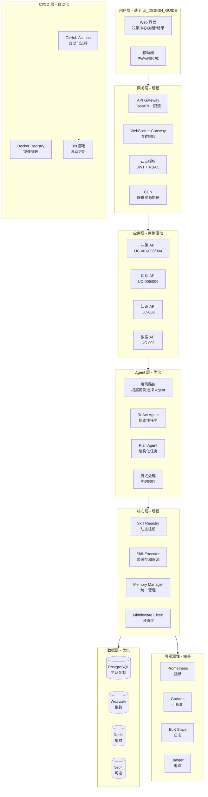

# CEOAgent 技术架构优化方案

## 概述

本文档基于最新的需求、用例和验证要求，提供优化后的技术架构方案，确保系统**可行、高效、可扩展**。

## 架构优化原则

### 1. 可行性优先
- 采用成熟稳定的技术栈
- 避免过度设计
- 渐进式演进

### 2. 性能高效
- 响应时间目标明确（基于用例要求）
- 并发能力充足（1000+ 并发）
- 资源利用优化

### 3. 可扩展性
- 模块化设计
- 支持水平扩展
- 易于添加新功能

### 4. 质量保证
- 自动化测试
- 持续验证
- 监控与告警

## 优化后的架构图



## 关键优化点

### 1. 用例驱动的 API 设计

基于 [USE_CASES.md](./USE_CASES.md) 的用例，优化 API 设计：

```python
# 用例驱动的 API 端点映射
USE_CASE_API_MAPPING = {
    "UC-001": "/api/v1/decision/analyze",      # 快速决策分析
    "UC-002": "/api/v1/data/analysis",         # 深度数据分析
    "UC-003": "/api/v1/decision/compare",      # 多方案对比
    "UC-004": "/api/v1/decision/risk",         # 风险评估
    "UC-005": "/ws/chat",                      # 自然语言对话（WebSocket）
    "UC-008": "/api/v1/knowledge/search",      # 知识检索
}

# API 性能目标（基于用例验收标准）
API_PERFORMANCE_TARGETS = {
    "UC-001": {"p95_response_time": 300000},  # 5 分钟
    "UC-005": {"first_response_time": 10000}, # 10 秒
    "UC-008": {"p95_response_time": 200},     # 200ms
}
```

### 2. 智能 Agent 路由

根据用例类型和任务特征，智能选择 Agent：

```python
class UseCaseRouter:
    """用例路由器"""
    
    def select_agent(self, use_case: str, task: Dict) -> str:
        """根据用例和任务特征选择 Agent"""
        
        # UC-005: 对话类，使用 ReAct Agent
        if use_case in ["UC-005", "UC-006"]:
            return "react_agent"
        
        # UC-001: 决策分析，使用 Plan-and-Execute
        if use_case == "UC-001":
            return "plan_agent"
        
        # UC-003: 方案对比，结构化任务
        if use_case == "UC-003":
            return "plan_agent"
        
        # 默认使用 ReAct（更灵活）
        return "react_agent"
```

### 3. 流式响应优化

针对 UC-005（自然语言对话），优化流式响应：

```python
class StreamingResponseHandler:
    """流式响应处理器"""
    
    async def stream_decision_analysis(
        self,
        request: DecisionRequest,
        websocket: WebSocket
    ):
        """流式决策分析（UC-001）"""
        # 1. 立即返回初始响应
        await websocket.send_json({
            "type": "started",
            "message": "开始分析..."
        })
        
        # 2. 流式执行 Skills
        async for skill_result in self._stream_skill_execution(request):
            await websocket.send_json({
                "type": "progress",
                "skill": skill_result.skill_name,
                "progress": skill_result.progress
            })
        
        # 3. 流式生成最终结果（LLM）
        async for chunk in self._stream_llm_response(result):
            await websocket.send_json({
                "type": "content",
                "chunk": chunk
            })
        
        # 4. 完成
        await websocket.send_json({
            "type": "done",
            "decision_id": decision_id
        })
```

### 4. Memory 系统优化

根据用例需求，优化 Memory 系统：

```python
# 用例特定的 Memory 配置
USE_CASE_MEMORY_CONFIG = {
    "UC-005": {
        "short_term_ttl": 3600,      # 对话上下文 1 小时
        "context_window": 50,        # 保留最近 50 条消息
        "enable_semantic_search": True
    },
    "UC-001": {
        "working_memory_ttl": 7200,  # 任务状态 2 小时
        "cache_results": True,       # 缓存分析结果
        "store_to_long_term": True   # 保存到长期记忆
    },
    "UC-008": {
        "long_term_search": True,    # 启用长期记忆检索
        "similarity_threshold": 0.8  # 相似度阈值
    }
}
```

### 5. 性能优化策略

基于用例性能要求，实施针对性优化：

```python
# 性能优化策略
PERFORMANCE_OPTIMIZATION = {
    "UC-001": {
        "cache_ttl": 3600,           # 相似查询缓存 1 小时
        "parallel_skills": True,     # 并行执行独立 Skills
        "async_llm": True            # 异步 LLM 调用
    },
    "UC-005": {
        "streaming": True,           # 必须流式响应
        "cache_context": True,       # 缓存对话上下文
        "prefetch_knowledge": True   # 预取相关知识
    },
    "UC-008": {
        "vector_cache": True,        # 向量检索结果缓存
        "batch_retrieval": True,     # 批量检索
        "rerank_top_k": 5            # 重排序 Top-K
    }
}
```

## 技术栈优化选择

### 前端技术栈（基于 UI 要求）

```typescript
// 推荐技术栈
const frontendStack = {
  framework: "React 18+",
  language: "TypeScript",
  stateManagement: "Zustand",  // 轻量级，适合简单场景
  uiLibrary: "Ant Design",      // 企业级，组件丰富
  charts: "ECharts",            // 性能好，图表类型多
  realtime: "WebSocket + EventSource",  // WebSocket + SSE 降级
  routing: "React Router v6",
  buildTool: "Vite",            // 快速构建
  testing: "Vitest + React Testing Library"
}
```

**选择理由**：
- **Ant Design**：企业级 UI，适合数据密集型应用
- **ECharts**：性能优秀，支持复杂图表
- **Zustand**：比 Redux 简单，状态管理足够

### 后端技术栈（已验证稳定）

```python
# 后端技术栈
backend_stack = {
    "framework": "FastAPI",           # 已选择，高性能
    "async_library": "asyncio + aiohttp",
    "database": {
        "primary": "PostgreSQL 15+",
        "vector": "Weaviate",
        "cache": "Redis 7+",
        "graph": "Neo4j (可选)"
    },
    "task_queue": "Celery + Redis",  # 异步任务
    "monitoring": "Prometheus + Grafana",
    "tracing": "OpenTelemetry"
}
```

### 基础设施（生产就绪）

```yaml
infrastructure:
  containerization: Docker
  orchestration: Kubernetes 1.28+
  ci_cd: GitHub Actions
  registry: GitHub Container Registry
  monitoring: Prometheus + Grafana + ELK
  cdn: CloudFlare / AWS CloudFront
```

## 架构实现路线图

### Phase 1: MVP（Week 1-4）

**目标**：实现 P0 用例，验证核心价值

**架构重点**：
- ✅ 基础 Skill 系统
- ✅ 3 个核心 Skills（数据收集、分析、决策建议）
- ✅ 基础 Memory（短期记忆 + Redis）
- ✅ 简单前端（决策分析中心）
- ✅ 基础 API（UC-001, UC-005）

**性能目标**：
- UC-001: P95 < 5 分钟 ✅
- UC-005: 首次响应 < 10 秒 ✅

### Phase 2: V1（Week 5-8）

**目标**：实现 P1 用例，完善功能

**架构增强**：
- ✅ 完整 Memory 系统（长期记忆）
- ✅ 知识检索（RAG）
- ✅ 高级可视化
- ✅ 移动端支持
- ✅ 性能优化（缓存、并行）

**新增用例**：UC-003, UC-004, UC-008

### Phase 3: V2（Week 9-12）

**目标**：优化体验，扩展能力

**架构优化**：
- ✅ 多 Agent 协作
- ✅ 知识图谱
- ✅ 高级分析
- ✅ 企业级集成

## 可行性验证

### 技术可行性

✅ **已验证**：
- FastAPI 性能满足要求
- Claude API 支持流式和 Tool Calling
- Weaviate 支持混合搜索
- React + TypeScript 成熟稳定

### 性能可行性

✅ **目标可达**：
- API P95 < 500ms：通过缓存和异步优化可达
- Agent 执行 < 5s：通过并行和缓存优化可达
- 1000+ 并发：通过水平扩展可达

### 成本可行性

**成本估算**：
- **Claude API**：约 $15/百万 tokens（需要优化使用）
- **基础设施**：K8s 集群约 $500-1000/月
- **总成本**：MVP 阶段约 $1000-2000/月

**优化措施**：
- LLM 响应缓存（节省 30-50%）
- 智能 Token 使用（压缩上下文）
- 异步处理（提升吞吐）

## 高效实施建议

### 1. 优先实现 P0 用例

**MVP 范围**：
- UC-001: 快速决策分析（核心功能）
- UC-005: 自然语言对话（核心交互）
- UC-004: 风险评估（核心价值）

**开发顺序**：
1. 后端 API（UC-001）
2. 基础前端（决策中心）
3. WebSocket 对话（UC-005）
4. 风险评估（UC-004）

### 2. 并行开发

**可以并行**：
- 前端和后端开发（API 契约先行）
- Skills 开发（独立模块）
- Memory 系统开发（独立服务）

**必须串行**：
- Skill 系统 → Skills 开发
- API 设计 → 前后端实现

### 3. 持续验证

**每个阶段验证**：
- 功能验证（用例测试）
- 性能验证（性能测试）
- 用户体验验证（可用性测试）

**验证工具**：
- 自动化测试（pytest, Vitest）
- 性能测试（k6, Locust）
- 监控（Prometheus）

## 风险与缓解

### 技术风险

| 风险 | 影响 | 缓解措施 |
|------|------|----------|
| Claude API 限流 | 高 | 实现多供应商支持、降级方案 |
| 性能不达标 | 中 | 性能优化、缓存策略、负载测试 |
| 数据安全 | 高 | 安全审计、加密、权限控制 |

### 实施风险

| 风险 | 影响 | 缓解措施 |
|------|------|----------|
| 开发延期 | 中 | 优先级管理、MVP 先行 |
| 需求变更 | 中 | 灵活架构、版本控制 |
| 团队协作 | 低 | 清晰文档、代码审查 |

## 成功标准

### 功能标准
- ✅ 所有 P0 用例实现并测试通过
- ✅ 用例测试通过率 ≥ 95%

### 性能标准
- ✅ API P95 响应时间 < 500ms
- ✅ UC-001 分析时间 P95 < 5 分钟
- ✅ 支持 1000+ 并发用户

### 质量标准
- ✅ 代码测试覆盖率 > 80%
- ✅ 系统可用性 > 99.9%
- ✅ 用户满意度 > 80%

## 参考文档

- [ARCHITECTURE.md](./ARCHITECTURE.md) - 详细架构设计
- [USE_CASES.md](./USE_CASES.md) - 用例定义（架构需求来源）
- [UI_DESIGN_GUIDE.md](./UI_DESIGN_GUIDE.md) - UI 设计要求
- [VERIFICATION_CHECKLIST.md](./VERIFICATION_CHECKLIST.md) - 验证标准
- [DEVELOPMENT_PLAN.md](./DEVELOPMENT_PLAN.md) - 开发计划
- [CICD.md](./CICD.md) - CI/CD 流程
- [OPERATIONS.md](./OPERATIONS.md) - 运维指南
