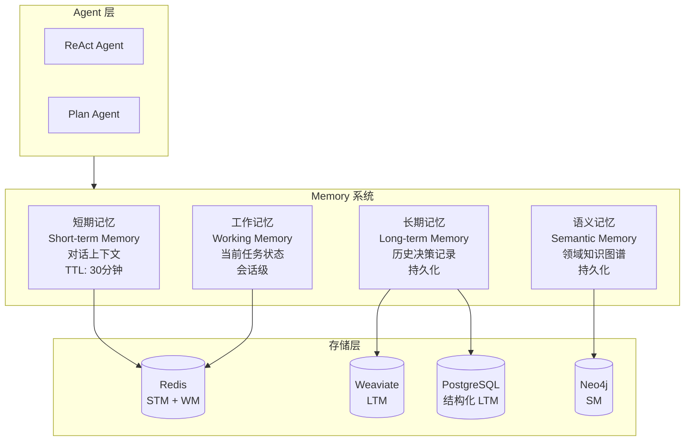

# Memory 系统设计文档

## 概述

Memory 系统是 AI Agent 的核心能力之一，负责管理 Agent 在不同时间尺度上的记忆，包括对话上下文、历史决策、领域知识等。CEOAgent 采用**多层次 Memory 架构**，模拟人类记忆系统。

## Memory 架构设计

### 四层 Memory 模型



## 1. 短期记忆 (Short-term Memory)

### 1.1 功能定义

**用途**：存储当前对话的上下文信息，类似于人类的短期记忆。

**特点**：
- 易失性：TTL 为 30 分钟
- 高访问频率
- 会话级别隔离

### 1.2 存储内容

```python
class ShortTermMemory:
    """短期记忆"""
    conversation_id: str          # 会话 ID
    messages: List[Message]       # 对话消息历史
    context: Dict[str, Any]       # 对话上下文
    user_preferences: Dict        # 用户偏好（本次会话）
    created_at: datetime          # 创建时间
    last_accessed: datetime       # 最后访问时间
    ttl: int = 1800               # 30 分钟 TTL
```

**存储结构**：
- **Key**: `stm:{conversation_id}`
- **Value**: JSON 序列化的对话历史
- **存储位置**: Redis

### 1.3 实现设计

```python
from typing import List, Dict, Any, Optional
from datetime import datetime, timedelta
import redis.asyncio as redis
import json

class ShortTermMemory:
    """短期记忆管理器"""
    
    def __init__(self, redis_client: redis.Redis, ttl: int = 1800):
        self.redis = redis_client
        self.ttl = ttl  # 30 分钟
    
    async def get_context(self, conversation_id: str) -> Optional[Dict[str, Any]]:
        """获取对话上下文"""
        key = f"stm:{conversation_id}"
        data = await self.redis.get(key)
        if data:
            await self.redis.expire(key, self.ttl)  # 刷新 TTL
            return json.loads(data)
        return None
    
    async def save_context(
        self, 
        conversation_id: str, 
        context: Dict[str, Any]
    ) -> None:
        """保存对话上下文"""
        key = f"stm:{conversation_id}"
        context["last_accessed"] = datetime.now().isoformat()
        await self.redis.setex(
            key, 
            self.ttl, 
            json.dumps(context, default=str)
        )
    
    async def add_message(
        self, 
        conversation_id: str, 
        role: str, 
        content: str
    ) -> None:
        """添加对话消息"""
        context = await self.get_context(conversation_id) or {
            "conversation_id": conversation_id,
            "messages": [],
            "created_at": datetime.now().isoformat()
        }
        
        context["messages"].append({
            "role": role,
            "content": content,
            "timestamp": datetime.now().isoformat()
        })
        
        # 限制消息数量（保留最近 50 条）
        if len(context["messages"]) > 50:
            context["messages"] = context["messages"][-50:]
        
        await self.save_context(conversation_id, context)
    
    async def clear(self, conversation_id: str) -> None:
        """清除短期记忆"""
        key = f"stm:{conversation_id}"
        await self.redis.delete(key)
```

### 1.4 使用场景

- 对话上下文维护
- 多轮对话理解
- 用户意图追踪
- 会话状态管理

## 2. 工作记忆 (Working Memory)

### 2.1 功能定义

**用途**：存储当前任务执行过程中的状态信息，类似于人类的工作记忆。

**特点**：
- 任务级别：每个任务有独立的 Working Memory
- 临时性：任务完成后可清理
- 状态追踪：记录任务执行进度

### 2.2 存储内容

```python
class WorkingMemory:
    """工作记忆"""
    task_id: str                  # 任务 ID
    conversation_id: str          # 关联的会话 ID
    task_type: str                # 任务类型
    status: str                   # 任务状态
    current_step: int             # 当前执行步骤
    executed_skills: List[str]    # 已执行的 Skills
    intermediate_results: Dict    # 中间结果
    error_history: List[Dict]     # 错误历史
    created_at: datetime
    updated_at: datetime
```

### 2.3 实现设计

```python
class WorkingMemory:
    """工作记忆管理器"""
    
    def __init__(self, redis_client: redis.Redis, ttl: int = 3600):
        self.redis = redis_client
        self.ttl = ttl  # 1 小时
    
    async def create_task(self, task_id: str, task_type: str) -> Dict[str, Any]:
        """创建新任务的工作记忆"""
        memory = {
            "task_id": task_id,
            "task_type": task_type,
            "status": "pending",
            "current_step": 0,
            "executed_skills": [],
            "intermediate_results": {},
            "error_history": [],
            "created_at": datetime.now().isoformat(),
            "updated_at": datetime.now().isoformat()
        }
        
        key = f"wm:{task_id}"
        await self.redis.setex(
            key, 
            self.ttl, 
            json.dumps(memory, default=str)
        )
        return memory
    
    async def update_task_status(
        self, 
        task_id: str, 
        status: str
    ) -> None:
        """更新任务状态"""
        memory = await self.get_task(task_id)
        if memory:
            memory["status"] = status
            memory["updated_at"] = datetime.now().isoformat()
            key = f"wm:{task_id}"
            await self.redis.setex(
                key, 
                self.ttl, 
                json.dumps(memory, default=str)
            )
    
    async def record_skill_execution(
        self, 
        task_id: str, 
        skill_name: str, 
        result: Any
    ) -> None:
        """记录 Skill 执行"""
        memory = await self.get_task(task_id)
        if memory:
            memory["executed_skills"].append({
                "skill": skill_name,
                "timestamp": datetime.now().isoformat(),
                "result": result
            })
            memory["intermediate_results"][skill_name] = result
            memory["updated_at"] = datetime.now().isoformat()
            key = f"wm:{task_id}"
            await self.redis.setex(
                key, 
                self.ttl, 
                json.dumps(memory, default=str)
            )
    
    async def get_task(self, task_id: str) -> Optional[Dict[str, Any]]:
        """获取任务工作记忆"""
        key = f"wm:{task_id}"
        data = await self.redis.get(key)
        if data:
            return json.loads(data)
        return None
```

### 2.4 使用场景

- 任务状态追踪
- 多步骤任务进度
- 错误恢复
- 任务重试

## 3. 长期记忆 (Long-term Memory)

### 3.1 功能定义

**用途**：持久化存储历史决策、用户反馈、学习数据等，类似于人类的长期记忆。

**特点**：
- 持久性：永久存储
- 向量化：支持语义检索
- 结构化：存储在关系数据库

### 3.2 存储内容

```python
class LongTermMemory:
    """长期记忆"""
    decision_id: str              # 决策 ID
    user_id: str                  # 用户 ID
    query: str                    # 原始查询
    context: Dict                 # 决策上下文
    skills_used: List[str]        # 使用的 Skills
    decision_result: Dict         # 决策结果
    user_feedback: Optional[Dict] # 用户反馈
    outcome: Optional[str]        # 实际结果（后续）
    embedding: List[float]        # 向量嵌入
    created_at: datetime
    updated_at: datetime
```

### 3.3 存储策略

**双重存储**：

1. **PostgreSQL**：存储结构化数据
   ```sql
   CREATE TABLE decisions (
       decision_id UUID PRIMARY KEY,
       user_id UUID NOT NULL,
       query TEXT NOT NULL,
       context JSONB,
       skills_used TEXT[],
       decision_result JSONB,
       user_feedback JSONB,
       outcome TEXT,
       created_at TIMESTAMP DEFAULT NOW(),
       updated_at TIMESTAMP DEFAULT NOW()
   );
   ```

2. **Weaviate**：存储向量和全文搜索
   ```python
   class_name = "Decision"
   properties = {
       "decision_id": str,
       "user_id": str,
       "query": str,
       "context": dict,
       "decision_result": dict,
       "embedding": list[float]
   }
   ```

### 3.4 实现设计

```python
from typing import List, Optional
import asyncpg
from anthropic import Anthropic

class LongTermMemory:
    """长期记忆管理器"""
    
    def __init__(
        self, 
        pg_pool: asyncpg.Pool,
        weaviate_client,
        embedding_client: Anthropic
    ):
        self.pg_pool = pg_pool
        self.weaviate = weaviate_client
        self.embedding_client = embedding_client
    
    async def store_decision(
        self,
        decision_id: str,
        user_id: str,
        query: str,
        context: Dict,
        skills_used: List[str],
        decision_result: Dict
    ) -> None:
        """存储决策记录"""
        
        # 1. 生成向量嵌入
        embedding = await self._generate_embedding(query, context)
        
        # 2. 存储到 PostgreSQL
        async with self.pg_pool.acquire() as conn:
            await conn.execute("""
                INSERT INTO decisions (
                    decision_id, user_id, query, context,
                    skills_used, decision_result, created_at
                ) VALUES ($1, $2, $3, $4, $5, $6, NOW())
            """, decision_id, user_id, query, json.dumps(context),
               skills_used, json.dumps(decision_result))
        
        # 3. 存储到 Weaviate
        await self.weaviate.data_object.create(
            class_name="Decision",
            data_object={
                "decision_id": decision_id,
                "user_id": user_id,
                "query": query,
                "context": context,
                "decision_result": decision_result,
                "skills_used": skills_used
            },
            vector=embedding
        )
    
    async def retrieve_similar_decisions(
        self,
        query: str,
        limit: int = 5,
        user_id: Optional[str] = None
    ) -> List[Dict]:
        """检索相似的历史决策"""
        
        # 1. 生成查询向量
        query_embedding = await self._generate_embedding(query)
        
        # 2. 在 Weaviate 中搜索
        where_filter = {"path": ["user_id"], "operator": "Equal", "valueString": user_id} if user_id else None
        
        results = await self.weaviate.query.get(
            class_name="Decision",
            limit=limit,
            where=where_filter
        ).with_near_vector({
            "vector": query_embedding
        }).do()
        
        return results.get("data", {}).get("Get", {}).get("Decision", [])
    
    async def update_feedback(
        self,
        decision_id: str,
        feedback: Dict,
        outcome: Optional[str] = None
    ) -> None:
        """更新用户反馈和结果"""
        
        # 更新 PostgreSQL
        async with self.pg_pool.acquire() as conn:
            await conn.execute("""
                UPDATE decisions
                SET user_feedback = $1, outcome = $2, updated_at = NOW()
                WHERE decision_id = $3
            """, json.dumps(feedback), outcome, decision_id)
        
        # 更新 Weaviate
        await self.weaviate.data_object.update(
            class_name="Decision",
            uuid=decision_id,
            data_object={
                "user_feedback": feedback,
                "outcome": outcome
            }
        )
    
    async def _generate_embedding(
        self, 
        text: str, 
        context: Optional[Dict] = None
    ) -> List[float]:
        """生成文本向量嵌入"""
        # 组合文本和上下文
        combined_text = text
        if context:
            combined_text += f"\nContext: {json.dumps(context)}"
        
        response = await self.embedding_client.embeddings.create(
            model="text-embedding-3-large",
            input=combined_text
        )
        return response.data[0].embedding
```

### 3.4 使用场景

- 历史决策检索（RAG）
- 相似案例学习
- 决策模式分析
- 用户偏好学习

## 4. 语义记忆 (Semantic Memory)

### 4.1 功能定义

**用途**：存储领域知识、实体关系、概念图谱等结构化知识，类似于人类的语义记忆。

**特点**：
- 结构化：图数据库存储
- 关联性：实体关系建模
- 可推理：支持图查询和推理

### 4.2 存储内容

**实体类型**：
- 公司（Company）
- 人物（Person）
- 事件（Event）
- 决策类型（DecisionType）
- 行业（Industry）
- 指标（Metric）

**关系类型**：
- BELONGS_TO（属于）
- RELATED_TO（相关）
- CAUSES（导致）
- IMPACTS（影响）
- SIMILAR_TO（相似）

### 4.3 实现设计

```python
from neo4j import AsyncGraphDatabase

class SemanticMemory:
    """语义记忆管理器（知识图谱）"""
    
    def __init__(self, neo4j_driver):
        self.driver = neo4j_driver
    
    async def create_entity(
        self,
        entity_type: str,
        entity_id: str,
        properties: Dict
    ) -> None:
        """创建实体"""
        async with self.driver.session() as session:
            await session.run(
                f"""
                MERGE (e:{entity_type} {{id: $id}})
                SET e += $properties
                """,
                id=entity_id,
                properties=properties
            )
    
    async def create_relationship(
        self,
        from_type: str,
        from_id: str,
        rel_type: str,
        to_type: str,
        to_id: str,
        properties: Optional[Dict] = None
    ) -> None:
        """创建关系"""
        async with self.driver.session() as session:
            query = f"""
                MATCH (a:{from_type} {{id: $from_id}})
                MATCH (b:{to_type} {{id: $to_id}})
                MERGE (a)-[r:{rel_type}]->(b)
                {f'SET r += $properties' if properties else ''}
            """
            await session.run(
                query,
                from_id=from_id,
                to_id=to_id,
                properties=properties or {}
            )
    
    async def find_related_entities(
        self,
        entity_type: str,
        entity_id: str,
        relationship_types: List[str],
        limit: int = 10
    ) -> List[Dict]:
        """查找相关实体"""
        async with self.driver.session() as session:
            rel_pattern = "|".join(relationship_types)
            result = await session.run(
                f"""
                MATCH (e:{entity_type} {{id: $id}})-[r:{rel_pattern}]->(related)
                RETURN related, type(r) as rel_type, r
                LIMIT $limit
                """,
                id=entity_id,
                limit=limit
            )
            return [record.values() for record in await result.values()]
    
    async def infer_decision_pattern(
        self,
        decision_type: str,
        context: Dict
    ) -> Dict:
        """推理决策模式"""
        # 基于知识图谱进行推理查询
        async with self.driver.session() as session:
            result = await session.run("""
                MATCH (dt:DecisionType {type: $type})<-[:HAS_TYPE]-(d:Decision)
                MATCH (d)-[:USED_SKILL]->(s:Skill)
                MATCH (d)-[:IMPACTS]->(m:Metric)
                RETURN s.name as skill, m.name as metric, count(*) as frequency
                ORDER BY frequency DESC
                LIMIT 10
            """, type=decision_type)
            
            patterns = [record.values() for record in await result.values()]
            return {"patterns": patterns}
```

### 4.4 使用场景

- 领域知识查询
- 实体关系推理
- 决策模式发现
- 知识图谱可视化

## Memory 系统集成

### Agent 中使用 Memory

```python
class EnhancedAgent:
    """增强的 Agent，集成 Memory 系统"""
    
    def __init__(
        self,
        stm: ShortTermMemory,
        wm: WorkingMemory,
        ltm: LongTermMemory,
        sm: SemanticMemory
    ):
        self.stm = stm
        self.wm = wm
        self.ltm = ltm
        self.sm = sm
    
    async def process_query(
        self,
        conversation_id: str,
        user_id: str,
        query: str
    ) -> Dict:
        """处理查询，使用所有 Memory 层"""
        
        # 1. 加载短期记忆（对话上下文）
        context = await self.stm.get_context(conversation_id)
        
        # 2. 检索长期记忆（相似历史决策）
        similar_decisions = await self.ltm.retrieve_similar_decisions(
            query,
            user_id=user_id,
            limit=5
        )
        
        # 3. 查询语义记忆（领域知识）
        entities = await self._extract_entities(query)
        related_knowledge = await self.sm.find_related_entities(
            "Company",
            entities.get("company_id"),
            ["BELONGS_TO", "RELATED_TO"]
        )
        
        # 4. 创建任务工作记忆
        task_id = generate_task_id()
        await self.wm.create_task(task_id, "decision_query")
        
        # 5. 构建增强的上下文
        enhanced_context = {
            "conversation_history": context.get("messages", []),
            "similar_decisions": similar_decisions,
            "domain_knowledge": related_knowledge,
            "user_id": user_id
        }
        
        # 6. 执行 Agent 逻辑
        result = await self._execute_agent(query, enhanced_context)
        
        # 7. 保存到长期记忆
        await self.ltm.store_decision(
            decision_id=generate_decision_id(),
            user_id=user_id,
            query=query,
            context=enhanced_context,
            skills_used=result["skills_used"],
            decision_result=result
        )
        
        # 8. 更新短期记忆
        await self.stm.add_message(conversation_id, "user", query)
        await self.stm.add_message(conversation_id, "assistant", result["answer"])
        
        return result
```

## 性能优化

### 1. 缓存策略

- **短期记忆**：Redis，高频访问
- **长期记忆检索结果**：缓存热门查询结果
- **语义记忆查询**：缓存图查询结果

### 2. 批量操作

- 批量存储决策记录
- 批量向量化
- 批量图查询

### 3. 异步处理

- 所有 Memory 操作异步化
- 长期记忆存储异步化（不阻塞响应）

## 数据迁移和备份

### 备份策略

- **PostgreSQL**：定期全量备份 + WAL 归档
- **Weaviate**：定期快照备份
- **Neo4j**：定期数据库备份
- **Redis**：RDB + AOF

### 迁移策略

- 版本化 Schema
- 数据迁移脚本
- 回滚机制

## 监控指标

- **短期记忆**：命中率、TTL 分布、内存使用
- **工作记忆**：任务数量、平均任务时长
- **长期记忆**：存储数量、检索延迟、向量化耗时
- **语义记忆**：实体数量、关系数量、查询延迟

## 参考文档

- [ARCHITECTURE.md](./ARCHITECTURE.md) - 系统架构
- [PERFORMANCE.md](./PERFORMANCE.md) - 性能优化
- [MONITORING.md](./MONITORING.md) - 监控指南
