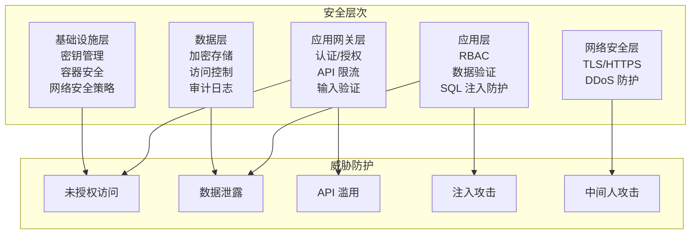

# 安全架构与最佳实践

## 安全架构概览

CEOAgent 采用**纵深防御（Defense in Depth）**策略，从多个层次保护系统安全。



## 1. 认证与授权

### 1.1 认证机制

#### JWT Token 认证

**实现**：
```python
from datetime import datetime, timedelta
import jwt
from passlib.context import CryptContext

class AuthService:
    """认证服务"""
    
    def __init__(self, secret_key: str, algorithm: str = "HS256"):
        self.secret_key = secret_key
        self.algorithm = algorithm
        self.pwd_context = CryptContext(schemes=["bcrypt"], deprecated="auto")
    
    def create_access_token(
        self,
        user_id: str,
        email: str,
        roles: List[str],
        expires_delta: Optional[timedelta] = None
    ) -> str:
        """创建访问 Token"""
        if expires_delta:
            expire = datetime.utcnow() + expires_delta
        else:
            expire = datetime.utcnow() + timedelta(hours=24)
        
        payload = {
            "sub": user_id,
            "email": email,
            "roles": roles,
            "exp": expire,
            "iat": datetime.utcnow(),
            "type": "access"
        }
        
        return jwt.encode(payload, self.secret_key, algorithm=self.algorithm)
    
    def verify_token(self, token: str) -> Dict:
        """验证 Token"""
        try:
            payload = jwt.decode(token, self.secret_key, algorithms=[self.algorithm])
            return payload
        except jwt.ExpiredSignatureError:
            raise SecurityException("Token has expired")
        except jwt.InvalidTokenError:
            raise SecurityException("Invalid token")
    
    def hash_password(self, password: str) -> str:
        """哈希密码"""
        return self.pwd_context.hash(password)
    
    def verify_password(self, plain_password: str, hashed_password: str) -> bool:
        """验证密码"""
        return self.pwd_context.verify(plain_password, hashed_password)
```

#### OAuth 2.0 / SSO 支持

**支持**：
- Google OAuth
- Microsoft Azure AD
- SAML 2.0
- OpenID Connect

### 1.2 授权机制

#### RBAC（基于角色的访问控制）

**角色定义**：
```python
class Role(Enum):
    """角色定义"""
    SUPER_ADMIN = "super_admin"      # 超级管理员
    ADMIN = "admin"                   # 管理员
    CEO = "ceo"                       # CEO 用户
    EXECUTIVE = "executive"           # 高管
    ANALYST = "analyst"               # 分析师
    VIEWER = "viewer"                 # 只读用户

class Permission(Enum):
    """权限定义"""
    # 决策权限
    DECISION_CREATE = "decision:create"
    DECISION_READ = "decision:read"
    DECISION_UPDATE = "decision:update"
    DECISION_DELETE = "decision:delete"
    
    # 数据权限
    DATA_READ = "data:read"
    DATA_WRITE = "data:write"
    DATA_EXPORT = "data:export"
    
    # 管理权限
    USER_MANAGE = "user:manage"
    SYSTEM_CONFIG = "system:config"
    AUDIT_VIEW = "audit:view"

# 角色权限映射
ROLE_PERMISSIONS = {
    Role.SUPER_ADMIN: list(Permission),
    Role.ADMIN: [
        Permission.DECISION_CREATE,
        Permission.DECISION_READ,
        Permission.DATA_READ,
        Permission.DATA_WRITE,
        Permission.USER_MANAGE,
        Permission.AUDIT_VIEW
    ],
    Role.CEO: [
        Permission.DECISION_CREATE,
        Permission.DECISION_READ,
        Permission.DATA_READ,
        Permission.DATA_EXPORT
    ],
    # ...
}
```

**权限检查中间件**：
```python
from fastapi import HTTPException, Depends
from functools import wraps

def require_permission(permission: Permission):
    """权限检查装饰器"""
    def decorator(func):
        @wraps(func)
        async def wrapper(*args, **kwargs):
            user = kwargs.get("current_user")
            if not user:
                raise HTTPException(status_code=401, detail="Not authenticated")
            
            user_permissions = get_user_permissions(user.roles)
            if permission not in user_permissions:
                raise HTTPException(
                    status_code=403,
                    detail=f"Permission denied: {permission.value}"
                )
            
            return await func(*args, **kwargs)
        return wrapper
    return decorator

@router.post("/api/v1/decision/analyze")
@require_permission(Permission.DECISION_CREATE)
async def analyze_decision(
    request: DecisionRequest,
    current_user: User = Depends(get_current_user)
):
    # 业务逻辑
    pass
```

### 1.3 Skill 级权限控制

```python
class SkillPermission:
    """Skill 权限控制"""
    
    # Skill 权限映射
    SKILL_PERMISSIONS = {
        "data_collection": Permission.DATA_READ,
        "data_analysis": Permission.DATA_READ,
        "decision_recommendation": Permission.DECISION_CREATE,
        "risk_assessment": Permission.DECISION_READ,
        # ...
    }
    
    @classmethod
    def check_skill_permission(
        cls,
        user: User,
        skill_name: str
    ) -> bool:
        """检查用户是否有权限执行 Skill"""
        required_permission = cls.SKILL_PERMISSIONS.get(skill_name)
        if not required_permission:
            return True  # 默认允许
        
        user_permissions = get_user_permissions(user.roles)
        return required_permission in user_permissions
```

## 2. 数据安全

### 2.1 数据加密

#### 传输加密

- **HTTPS/TLS 1.3**：所有 API 通信使用 TLS 加密
- **WebSocket Secure (WSS)**：WebSocket 连接加密
- **证书管理**：自动续期、证书轮换

#### 存储加密

**敏感数据加密**：
```python
from cryptography.fernet import Fernet
import base64
import os

class DataEncryption:
    """数据加密服务"""
    
    def __init__(self, key: bytes = None):
        if key is None:
            key = Fernet.generate_key()
        self.cipher = Fernet(key)
    
    def encrypt(self, data: str) -> str:
        """加密数据"""
        return self.cipher.encrypt(data.encode()).decode()
    
    def decrypt(self, encrypted_data: str) -> str:
        """解密数据"""
        return self.cipher.decrypt(encrypted_data.encode()).decode()

# 使用示例
encryption = DataEncryption(os.getenv("ENCRYPTION_KEY"))

# 加密敏感字段
encrypted_sensitive_data = encryption.encrypt(json.dumps(sensitive_data))
```

**数据库字段加密**：
- PostgreSQL：使用 `pgcrypto` 扩展
- 敏感字段（密码、API 密钥）使用 AES-256 加密

### 2.2 数据隔离

#### 多租户隔离

**Row Level Security (RLS)**：
```sql
-- PostgreSQL RLS 策略
ALTER TABLE decisions ENABLE ROW LEVEL SECURITY;

CREATE POLICY user_isolation_policy ON decisions
    FOR ALL
    TO authenticated_user
    USING (user_id = current_setting('app.current_user_id')::uuid);

-- 设置当前用户 ID
SET app.current_user_id = 'user-uuid';
```

**应用层隔离**：
```python
async def get_user_decisions(
    user_id: str,
    db: Database
) -> List[Decision]:
    """获取用户的决策记录（自动过滤其他用户数据）"""
    # 确保查询包含 user_id 过滤
    query = """
        SELECT * FROM decisions
        WHERE user_id = $1
    """
    return await db.fetch(query, user_id)
```

### 2.3 数据脱敏

```python
class DataMasking:
    """数据脱敏"""
    
    @staticmethod
    def mask_email(email: str) -> str:
        """脱敏邮箱"""
        if "@" not in email:
            return email
        local, domain = email.split("@", 1)
        if len(local) <= 2:
            masked_local = "*" * len(local)
        else:
            masked_local = local[0] + "*" * (len(local) - 2) + local[-1]
        return f"{masked_local}@{domain}"
    
    @staticmethod
    def mask_phone(phone: str) -> str:
        """脱敏手机号"""
        if len(phone) <= 4:
            return "*" * len(phone)
        return phone[:3] + "*" * (len(phone) - 6) + phone[-3:]
    
    @staticmethod
    def mask_financial_data(data: Dict) -> Dict:
        """脱敏财务数据"""
        masked = data.copy()
        sensitive_fields = ["amount", "revenue", "profit", "cost"]
        for field in sensitive_fields:
            if field in masked:
                # 保留数量级，隐藏具体数值
                value = masked[field]
                if isinstance(value, (int, float)):
                    masked[field] = round(value, -3)  # 四舍五入到千位
        return masked
```

## 3. API 安全

### 3.1 输入验证

**Pydantic 验证**：
```python
from pydantic import BaseModel, validator, Field
from typing import Optional

class DecisionRequest(BaseModel):
    """决策请求模型（带验证）"""
    query: str = Field(..., min_length=1, max_length=5000)
    context: Optional[Dict] = Field(default_factory=dict)
    options: List[str] = Field(..., min_items=1, max_items=10)
    
    @validator('query')
    def validate_query(cls, v):
        # 检查 SQL 注入模式
        dangerous_patterns = ["'", '"', ';', '--', '/*', '*/', 'xp_', 'exec']
        for pattern in dangerous_patterns:
            if pattern in v.lower():
                raise ValueError(f"Query contains potentially dangerous pattern: {pattern}")
        return v
    
    @validator('options')
    def validate_options(cls, v):
        # 验证选项数量
        if len(v) > 10:
            raise ValueError("Too many options (max 10)")
        return v
```

### 3.2 SQL 注入防护

**参数化查询**：
```python
# 正确：使用参数化查询
async def get_decision(decision_id: str, db: Database):
    query = "SELECT * FROM decisions WHERE decision_id = $1"
    return await db.fetch_one(query, decision_id)

# 错误：字符串拼接（易受 SQL 注入攻击）
async def get_decision_unsafe(decision_id: str, db: Database):
    query = f"SELECT * FROM decisions WHERE decision_id = '{decision_id}'"  # 危险！
    return await db.fetch_one(query)
```

### 3.3 API 限流

**Token Bucket 算法**：
```python
import time
from collections import defaultdict

class RateLimiter:
    """限流器（Token Bucket）"""
    
    def __init__(self, rate: int, capacity: int):
        """
        Args:
            rate: 每秒补充的 token 数量
            capacity: 桶容量
        """
        self.rate = rate
        self.capacity = capacity
        self.tokens = defaultdict(lambda: capacity)
        self.last_refill = defaultdict(lambda: time.time())
    
    async def acquire(self, key: str) -> bool:
        """获取 token"""
        now = time.time()
        last_refill = self.last_refill[key]
        
        # 补充 token
        elapsed = now - last_refill
        tokens_to_add = elapsed * self.rate
        self.tokens[key] = min(
            self.capacity,
            self.tokens[key] + tokens_to_add
        )
        self.last_refill[key] = now
        
        # 检查是否有可用 token
        if self.tokens[key] >= 1:
            self.tokens[key] -= 1
            return True
        return False

# 使用示例
rate_limiter = RateLimiter(rate=10, capacity=100)  # 每秒 10 个请求，容量 100

@router.post("/api/v1/decision/analyze")
async def analyze_decision(
    request: DecisionRequest,
    current_user: User = Depends(get_current_user)
):
    # 基于用户的限流
    user_key = f"user:{current_user.id}"
    if not await rate_limiter.acquire(user_key):
        raise HTTPException(
            status_code=429,
            detail="Rate limit exceeded. Please try again later."
        )
    
    # 处理请求
    pass
```

**基于 IP 和用户的限流**：
```python
from slowapi import Limiter, _rate_limit_exceeded_handler
from slowapi.util import get_remote_address
from slowapi.errors import RateLimitExceeded

limiter = Limiter(key_func=get_remote_address)
app.state.limiter = limiter
app.add_exception_handler(RateLimitExceeded, _rate_limit_exceeded_handler)

@router.post("/api/v1/decision/analyze")
@limiter.limit("10/minute")  # 每分钟 10 次
async def analyze_decision(request: Request, ...):
    pass
```

## 4. 审计与合规

### 4.1 审计日志

**审计日志模型**：
```python
class AuditLog(BaseModel):
    """审计日志"""
    log_id: str
    user_id: str
    action: str                  # 操作类型
    resource_type: str           # 资源类型
    resource_id: str             # 资源 ID
    details: Dict                # 详细信息
    ip_address: str              # IP 地址
    user_agent: str              # User Agent
    timestamp: datetime          # 时间戳
    result: str                  # 结果（success/failure）

class AuditLogger:
    """审计日志记录器"""
    
    async def log(
        self,
        user_id: str,
        action: str,
        resource_type: str,
        resource_id: str,
        details: Dict,
        request: Request,
        result: str = "success"
    ):
        """记录审计日志"""
        log = AuditLog(
            log_id=generate_uuid(),
            user_id=user_id,
            action=action,
            resource_type=resource_type,
            resource_id=resource_id,
            details=details,
            ip_address=request.client.host,
            user_agent=request.headers.get("user-agent", ""),
            timestamp=datetime.utcnow(),
            result=result
        )
        
        # 存储到数据库（不可变）
        await self.db.insert("audit_logs", log.dict())
        
        # 发送到日志系统
        await self.logger.info("audit", log.dict())
```

**关键操作审计**：
```python
# 自动审计装饰器
def audit_log(action: str, resource_type: str):
    """审计日志装饰器"""
    def decorator(func):
        @wraps(func)
        async def wrapper(*args, **kwargs):
            current_user = kwargs.get("current_user")
            request = kwargs.get("request")
            
            try:
                result = await func(*args, **kwargs)
                
                # 记录成功操作
                await audit_logger.log(
                    user_id=current_user.id,
                    action=action,
                    resource_type=resource_type,
                    resource_id=result.get("id"),
                    details={"status": "success"},
                    request=request,
                    result="success"
                )
                
                return result
            except Exception as e:
                # 记录失败操作
                await audit_logger.log(
                    user_id=current_user.id,
                    action=action,
                    resource_type=resource_type,
                    resource_id="",
                    details={"error": str(e)},
                    request=request,
                    result="failure"
                )
                raise
        return wrapper
    return decorator

@router.post("/api/v1/decision/analyze")
@audit_log("decision.analyze", "decision")
async def analyze_decision(...):
    pass
```

### 4.2 决策追溯（Decision Trail）

```python
class DecisionTrail:
    """决策追溯"""
    
    async def create_trail(
        self,
        decision_id: str,
        user_id: str,
        query: str,
        context: Dict,
        skills_used: List[str],
        reasoning: str,
        result: Dict
    ):
        """创建决策追溯记录"""
        trail = {
            "decision_id": decision_id,
            "user_id": user_id,
            "timestamp": datetime.utcnow(),
            "query": query,
            "context": context,
            "skills_used": skills_used,
            "reasoning": reasoning,
            "result": result,
            "version": "1.0"
        }
        
        # 存储到不可变存储（如 S3 + 数据库索引）
        await self.store_trail(trail)
```

### 4.3 GDPR/合规支持

**数据删除（Right to be Forgotten）**：
```python
async def delete_user_data(user_id: str):
    """删除用户数据（GDPR）"""
    # 1. 删除决策记录
    await db.execute("DELETE FROM decisions WHERE user_id = $1", user_id)
    
    # 2. 删除向量数据库中的数据
    await weaviate_client.data_object.delete(
        class_name="Decision",
        where={"path": ["user_id"], "operator": "Equal", "valueString": user_id}
    )
    
    # 3. 删除用户账户
    await db.execute("DELETE FROM users WHERE user_id = $1", user_id)
    
    # 4. 记录删除操作（审计）
    await audit_logger.log(
        user_id=user_id,
        action="data_deletion",
        resource_type="user",
        resource_id=user_id,
        details={"reason": "GDPR request"},
        result="success"
    )
```

**数据导出（Data Portability）**：
```python
async def export_user_data(user_id: str) -> Dict:
    """导出用户数据（GDPR）"""
    # 收集所有用户相关数据
    data = {
        "user_info": await db.fetch_one("SELECT * FROM users WHERE user_id = $1", user_id),
        "decisions": await db.fetch("SELECT * FROM decisions WHERE user_id = $1", user_id),
        "audit_logs": await db.fetch("SELECT * FROM audit_logs WHERE user_id = $1", user_id),
        # ...
    }
    
    return data
```

## 5. 密钥管理

### 5.1 密钥存储

**使用环境变量和密钥管理服务**：
- **开发环境**：`.env` 文件（不提交到 Git）
- **生产环境**：AWS Secrets Manager / HashiCorp Vault / Kubernetes Secrets

### 5.2 密钥轮换

```python
class SecretManager:
    """密钥管理器"""
    
    async def rotate_api_key(self, key_name: str):
        """轮换 API 密钥"""
        # 1. 生成新密钥
        new_key = generate_secret_key()
        
        # 2. 更新密钥（保持旧密钥一段时间）
        await self.update_key(key_name, new_key, keep_old=True)
        
        # 3. 等待旧密钥过期（如 24 小时）
        await asyncio.sleep(24 * 3600)
        
        # 4. 删除旧密钥
        await self.remove_old_key(key_name)
```

## 6. 安全最佳实践

### 6.1 代码安全

- **依赖扫描**：定期扫描依赖漏洞（如 `safety`、`bandit`）
- **代码审查**：所有代码变更需要审查
- **安全测试**：定期进行安全测试和渗透测试

### 6.2 容器安全

- **最小化镜像**：使用最小化基础镜像
- **非 root 用户**：容器内使用非 root 用户运行
- **镜像扫描**：扫描容器镜像漏洞
- **网络策略**：Kubernetes 网络策略限制容器通信

### 6.3 网络安全

- **防火墙规则**：限制不必要的端口
- **VPC 隔离**：生产环境使用私有网络
- **DDoS 防护**：使用 CDN 和 DDoS 防护服务

## 7. 安全监控

### 7.1 异常检测

```python
class SecurityMonitor:
    """安全监控"""
    
    async def detect_anomalies(self, user_id: str, action: str):
        """检测异常行为"""
        # 1. 检查登录频率
        recent_logins = await self.get_recent_logins(user_id, hours=1)
        if len(recent_logins) > 10:
            await self.alert("Suspicious login frequency", user_id)
        
        # 2. 检查 API 调用模式
        recent_calls = await self.get_recent_api_calls(user_id, minutes=5)
        if len(recent_calls) > 100:
            await self.alert("Suspicious API call pattern", user_id)
        
        # 3. 检查地理位置变化
        current_location = await self.get_user_location(user_id)
        last_location = await self.get_last_location(user_id)
        if self.is_location_suspicious(current_location, last_location):
            await self.alert("Suspicious location change", user_id)
```

### 7.2 安全告警

- **异常登录告警**
- **权限提升告警**
- **大量数据访问告警**
- **API 滥用告警**

## 参考文档

- [ARCHITECTURE.md](./ARCHITECTURE.md) - 系统架构
- [API_DESIGN.md](./API_DESIGN.md) - API 设计规范
- [DEPLOYMENT.md](./DEPLOYMENT.md) - 部署指南
