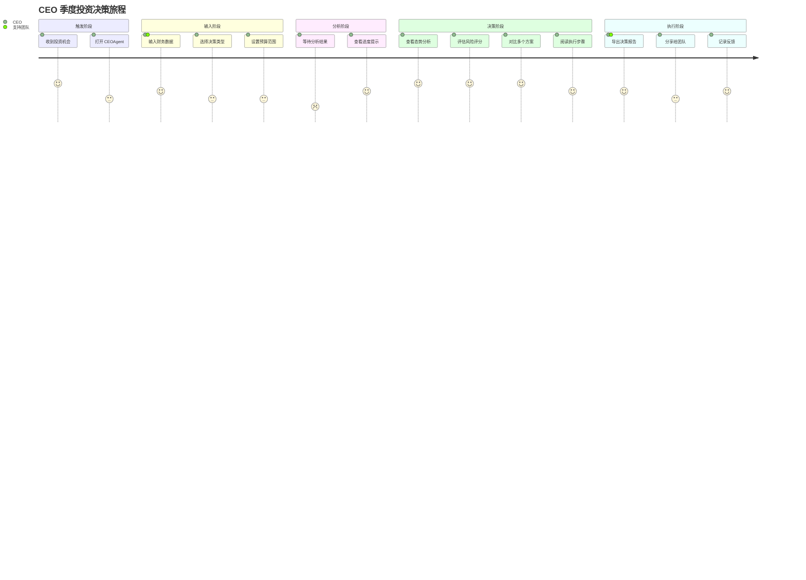
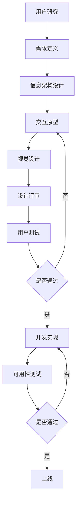
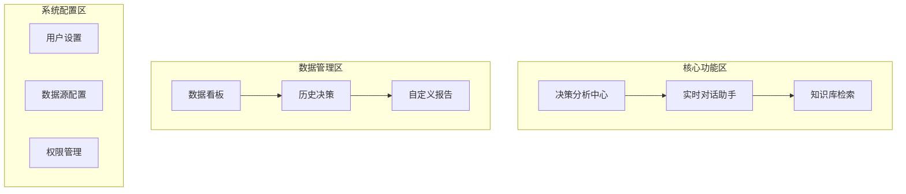

# CEOAgent UI 设计指南

## 文档目的

本文档从**项目使用者**和**UI 设计者**的双重视角，提供 UI 设计的完整方法论、流程和规范，确保界面设计能够有效支持 CEO 决策场景，并验证是否达到项目目标。

---

## 1. 用户研究与角色定义

### 1.1 目标用户画像

#### 主要用户：CEO / 高管

**基本信息：**
- **角色**：企业决策者、战略制定者
- **技术背景**：非技术背景，但熟悉业务工具（Excel、PPT、邮件等）
- **决策风格**：数据驱动，但需要快速、清晰的可视化呈现
- **使用场景**：
  - 每日/每周决策例会
  - 季度战略规划
  - 突发危机应对
  - 投资/并购决策

**关键需求：**
- ⚡ **速度**：决策建议必须在 5-30 分钟内获得
- 📊 **可视化**：偏好图表、仪表板而非纯文字
- 🎯 **简洁**：信息密度高但不混乱
- 📱 **移动端**：需要随时查看（手机/平板）
- 🔒 **安全**：数据敏感，需要严格权限控制

#### 次要用户：决策支持团队

**基本信息：**
- **角色**：数据分析师、战略顾问、CFO/COO
- **技术背景**：中等技术背景
- **使用场景**：
  - 准备决策报告
  - 深度数据分析
  - 配置系统参数

**关键需求：**
- 📈 **详细数据**：需要可下载的详细报告
- ⚙️ **可配置**：能够调整分析参数
- 📝 **协作**：注释、分享功能

---

### 1.2 用户旅程地图

#### 典型决策场景：季度投资决策



**关键痛点：**
1. ❌ 等待时间过长，无法看到进度
2. ❌ 信息过载，难以快速抓住重点
3. ❌ 方案对比不够直观
4. ❌ 移动端体验差

**设计机会点：**
1. ✅ 实时进度展示（WebSocket 流式响应）
2. ✅ 分层信息架构（概览 → 详情）
3. ✅ 可视化方案对比（图表、矩阵）
4. ✅ 响应式设计（优先移动端）

---

## 2. UI 设计方法论

### 2.1 设计流程（Design Process）



### 2.2 设计原则

#### 核心原则

1. **效率优先（Efficiency First）**
   - 减少点击次数（最多 3 步到达目标）
   - 减少等待时间（实时反馈）
   - 减少认知负担（清晰的信息层次）

2. **数据可视化（Data Visualization）**
   - 优先图表，次选表格，最后才是文字
   - 使用颜色编码（红色=风险，绿色=机会）
   - 支持交互式图表（hover、筛选）

3. **移动优先（Mobile First）**
   - 响应式设计（适配手机、平板、桌面）
   - 关键功能在小屏幕上可用
   - 触摸友好（按钮大小 ≥ 44px）

4. **信任建立（Trust Building）**
   - 透明化 AI 推理过程（显示使用的数据源、Skills）
   - 提供决策依据（可追溯性）
   - 错误处理友好（明确提示，给出解决方案）

5. **一致性（Consistency）**
   - 统一的设计语言（颜色、字体、间距）
   - 一致的交互模式（按钮、表单、导航）
   - 一致的反馈机制（成功、错误、加载）

---

## 3. 信息架构设计

### 3.1 功能模块划分



### 3.2 页面结构

#### 主页面（Dashboard）

**布局：侧边栏导航 + 主内容区**

```
┌─────────────────────────────────────────────────┐
│  Logo  |  CEOAgent        [用户菜单] [通知]      │  ← Header (固定)
├────┬────────────────────────────────────────────┤
│    │                                            │
│ 导 │                                            │
│ 航 │         主内容区（动态加载）                 │
│ 栏 │                                            │
│    │                                            │
│ ( │                                            │
│ 固 │                                            │
│ 定 │                                            │
│ )  │                                            │
└────┴────────────────────────────────────────────┘
```

**导航栏结构：**
```
📊 决策中心
  ├─ 💬 智能对话
  ├─ 📈 数据分析
  └─ 🎯 决策建议

📚 知识库
  ├─ 🔍 检索
  ├─ 📝 案例库
  └─ 📊 行业报告

📋 历史记录
  ├─ 决策历史
  ├─ 分析报告
  └─ 导出记录

⚙️ 设置
  ├─ 个人偏好
  ├─ 数据源配置
  └─ 权限管理
```

---

## 4. 核心页面设计

### 4.1 决策分析中心（Decision Center）

**页面目标：** 快速启动决策分析，查看结果

#### 布局设计

```
┌─────────────────────────────────────────────────┐
│  ← 返回  |  决策分析中心                           │
├─────────────────────────────────────────────────┤
│                                                  │
│  ┌──────────────┐  ┌──────────────┐            │
│  │ 快速分析     │  │ 历史决策      │            │
│  │ [创建新分析] │  │ [查看全部]    │            │
│  └──────────────┘  └──────────────┘            │
│                                                  │
│  ┌────────────────────────────────────────┐    │
│  │  最近的分析                              │    │
│  │  ┌──────┐ ┌──────┐ ┌──────┐           │    │
│  │  │决策1 │ │决策2 │ │决策3 │           │    │
│  │  └──────┘ └──────┘ └──────┘           │    │
│  └────────────────────────────────────────┘    │
└─────────────────────────────────────────────────┘
```

#### 快速分析表单

**设计要点：**
- ✅ 步骤式向导（3 步：输入 → 确认 → 结果）
- ✅ 智能默认值（根据历史数据预填充）
- ✅ 实时验证（即时反馈输入错误）
- ✅ 进度提示（显示当前步骤：1/3）

**表单字段：**

```typescript
// 步骤 1: 基本信息
{
  decisionType: "investment" | "strategic" | "crisis" | "resource",
  title: string, // 决策标题
  priority: "high" | "medium" | "low",
}

// 步骤 2: 数据输入
{
  financialData: {
    // 财务数据输入（表格或上传文件）
    revenue: number[],
    profit: number[],
    cashFlow: number[],
  },
  budgetRange: {
    min: number,
    max: number,
  },
  constraints: string[], // 约束条件
}

// 步骤 3: 确认
{
  summary: string, // 系统生成的摘要
  estimatedTime: string, // 预计分析时间
}
```

---

### 4.2 智能对话界面（Chat Interface）

**页面目标：** 自然语言交互，获取决策建议

#### 布局设计

```
┌─────────────────────────────────────────────────┐
│  💬 智能对话助手                                  │
├─────────────────────────────────────────────────┤
│                                                  │
│  ┌──────────────────────────────────────────┐  │
│  │  [消息历史]                               │  │
│  │                                           │  │
│  │  用户: 帮我分析一下 Q3 的投资机会         │  │
│  │                                           │  │
│  │  AI: [正在思考...]                       │  │
│  │       [流式输出中...]                    │  │
│  │                                           │  │
│  └──────────────────────────────────────────┘  │
│                                                  │
│  ┌──────────────────────────────────────────┐  │
│  │  [输入框]  💬 输入你的问题...            │  │
│  │           [附件📎] [语音🎤] [发送]       │  │
│  └──────────────────────────────────────────┘  │
└─────────────────────────────────────────────────┘
```

#### 设计要点

1. **流式响应显示**
   - 实时显示 AI 生成内容（类似 ChatGPT）
   - 显示思考过程（"正在分析数据..."）
   - 支持 Markdown 渲染（标题、列表、代码块）

2. **上下文记忆**
   - 显示对话历史
   - 支持引用之前的对话
   - 自动保存对话（短期记忆）

3. **多模态输入**
   - 文本输入（默认）
   - 文件上传（Excel、PDF、图片）
   - 语音输入（可选，移动端优先）

4. **智能建议**
   - 常用问题快捷按钮
   - 自动补全
   - 相关案例推荐

---

### 4.3 决策结果展示页（Decision Result）

**页面目标：** 清晰、结构化地展示决策分析结果

#### 布局设计（分层信息架构）

```
┌─────────────────────────────────────────────────┐
│  ← 返回  |  投资决策分析 - Q3 2024              │
├─────────────────────────────────────────────────┤
│                                                  │
│  📊 执行摘要 (可展开/折叠)                        │
│  ┌──────────────────────────────────────────┐  │
│  │  风险评分: 7/10 (中等风险)                │  │
│  │  推荐方案: 方案A - 保守型投资              │  │
│  │  预期回报: 15-20%                         │  │
│  └──────────────────────────────────────────┘  │
│                                                  │
│  📈 态势分析 (图表展示)                          │
│  ┌──────────────────────────────────────────┐  │
│  │  [财务趋势图表]                           │  │
│  │  [市场对比图表]                           │  │
│  └──────────────────────────────────────────┘  │
│                                                  │
│  ⚠️ 风险评估 (矩阵图)                            │
│  ┌──────────────────────────────────────────┐  │
│  │  [风险矩阵]                               │  │
│  └──────────────────────────────────────────┘  │
│                                                  │
│  🎯 决策方案 (卡片对比)                          │
│  ┌──────┐  ┌──────┐  ┌──────┐                │
│  │方案A │  │方案B │  │方案C │                │
│  │[推荐]│  │      │  │      │                │
│  └──────┘  └──────┘  └──────┘                │
│                                                  │
│  📋 执行步骤 (时间线)                            │
│  ┌──────────────────────────────────────────┐  │
│  │  [甘特图/时间线]                          │  │
│  └──────────────────────────────────────────┘  │
│                                                  │
│  [导出报告] [分享] [反馈]                        │
└─────────────────────────────────────────────────┘
```

#### 关键组件设计

**1. 风险评分可视化**
```
┌────────────────────────────────────┐
│  总体风险评分: 7/10                │
│  ████████░░ 70%                    │
│                                    │
│  风险因子:                         │
│  ┌─────────┬──────┬────────────┐  │
│  │ 现金流   │ 高   │ 储备不足    │  │
│  │ 市场     │ 中   │ 增速放缓    │  │
│  │ 竞争     │ 低   │ 相对稳定    │  │
│  └─────────┴──────┴────────────┘  │
└────────────────────────────────────┘
```

**2. 方案对比卡片**
```
┌─────────────────────────────────────┐
│  🏆 方案A：保守型投资 [推荐]         │
├─────────────────────────────────────┤
│  投资金额: 500万                     │
│  预期回报: 15-20%                    │
│  风险等级: ⭐⭐ (低)                 │
│  时间周期: 6个月                     │
│                                    │
│  ✅ 优点:                           │
│    • 风险可控                        │
│    • 现金流压力小                    │
│                                    │
│  ❌ 缺点:                           │
│    • 增长较慢                        │
│                                    │
│  [查看详情] [选择此方案]             │
└─────────────────────────────────────┘
```

**3. 执行步骤时间线**
```
┌─────────────────────────────────────┐
│  执行步骤                            │
│                                    │
│  Week 1  ████░░░░░░░░░░  [完成尽调] │
│  Week 2-3 ░░░░████░░░░░░  [谈判条款] │
│  Week 4   ░░░░░░░░████░░  [签约]    │
│                                    │
│  [导出为日历] [添加到任务]           │
└─────────────────────────────────────┘
```

---

### 4.4 数据看板（Dashboard）

**页面目标：** 一屏展示关键指标和趋势

#### 布局设计

```
┌─────────────────────────────────────────────────┐
│  数据看板                                        │
├─────────────────────────────────────────────────┤
│                                                  │
│  ┌────────┐ ┌────────┐ ┌────────┐ ┌────────┐ │
│  │ 总收入  │ │ 净利润  │ │ 现金流  │ │ 决策数  │ │
│  │ 3.65M  │ │ 485K   │ │ +370K  │ │  12   │ │
│  │ ↑ 12%  │ │ ↓ 5%   │ │ ↑ 18%  │ │ ↑ 3   │ │
│  └────────┘ └────────┘ └────────┘ └────────┘ │
│                                                  │
│  ┌────────────────────┐ ┌────────────────────┐ │
│  │  财务趋势 (季度)    │ │  决策成功率         │ │
│  │  [折线图]          │ │  [饼图]            │ │
│  └────────────────────┘ └────────────────────┘ │
│                                                  │
│  ┌────────────────────────────────────────────┐ │
│  │  最近决策                                  │ │
│  │  [列表]                                    │ │
│  └────────────────────────────────────────────┘ │
└─────────────────────────────────────────────────┘
```

---

## 5. 视觉设计规范

### 5.1 颜色系统

**主色调：**
- **主色（Primary）**: `#1890FF` (蓝色 - 专业、可信)
- **成功（Success）**: `#52C41A` (绿色 - 低风险、正面)
- **警告（Warning）**: `#FAAD14` (橙色 - 中等风险)
- **错误（Error）**: `#F5222D` (红色 - 高风险、负面)
- **信息（Info）**: `#13C2C2` (青色 - 中性信息)

**中性色：**
- **文字主色**: `#262626` (深灰)
- **文字次色**: `#595959` (中灰)
- **文字辅助**: `#8C8C8C` (浅灰)
- **背景色**: `#FAFAFA` (浅灰背景)
- **边框色**: `#D9D9D9` (浅边框)

**风险等级颜色映射：**
```
低风险 (1-3):   #52C41A (绿色)
中风险 (4-7):   #FAAD14 (橙色)
高风险 (8-10):  #F5222D (红色)
```

### 5.2 字体系统

**字体族：**
- **中文**: `PingFang SC`, `Microsoft YaHei`, `sans-serif`
- **英文/数字**: `Inter`, `Helvetica Neue`, `Arial`, `sans-serif`
- **等宽**: `Menlo`, `Monaco`, `Consolas`, `monospace` (代码、数据)

**字号层级：**
```
H1: 32px  (页面标题)
H2: 24px  (区块标题)
H3: 20px  (卡片标题)
H4: 16px  (子标题)
Body: 14px (正文)
Caption: 12px (辅助文字)
```

### 5.3 间距系统

**基础单位：** 8px

**间距规范：**
```
xs: 4px   (紧密)
sm: 8px   (小)
md: 16px  (中)
lg: 24px  (大)
xl: 32px  (超大)
xxl: 48px (特大)
```

### 5.4 组件规范

**按钮：**
- 主要按钮：高度 40px，圆角 4px
- 次要按钮：高度 36px，边框样式
- 图标按钮：44x44px (移动端触摸友好)

**卡片：**
- 圆角：8px
- 阴影：`0 2px 8px rgba(0,0,0,0.1)`
- 内边距：16px / 24px

**表单：**
- 输入框高度：40px
- 标签字体：14px，颜色 `#595959`
- 错误提示：红色，12px

---

## 6. 交互设计规范

### 6.1 反馈机制

**加载状态：**
- 骨架屏（Skeleton Screen）- 首次加载
- 进度条 - 长任务（> 3秒）
- 加载动画 - 短任务（< 3秒）
- 百分比显示 - 可量化的进度

**成功反馈：**
- Toast 提示（3秒自动消失）
- 图标动画（✓ 打勾）
- 状态更新（按钮变灰，文字变"已提交"）

**错误反馈：**
- 红色文字提示 + 图标
- 明确的错误原因
- 提供解决方案（如："请检查数据格式"）

### 6.2 动效设计

**过渡动画：**
- 页面切换：300ms ease-in-out
- 模态框：200ms ease-out
- 悬停效果：150ms ease-in-out

**禁止：**
- ❌ 过度动画（影响性能）
- ❌ 自动播放视频/动画（干扰阅读）
- ❌ 闪烁效果（可访问性问题）

---

## 7. 响应式设计

### 7.1 断点定义

```css
/* 移动端优先 */
xs: < 576px   (手机竖屏)
sm: ≥ 576px   (手机横屏)
md: ≥ 768px   (平板)
lg: ≥ 992px   (桌面)
xl: ≥ 1200px  (大屏)
xxl: ≥ 1600px (超大屏)
```

### 7.2 适配策略

**手机端（< 768px）：**
- 导航栏改为底部标签栏
- 卡片单列显示
- 表格改为卡片列表
- 图表简化（只显示关键指标）

**平板端（768px - 992px）：**
- 侧边栏可折叠
- 卡片双列显示
- 图表保持完整

**桌面端（≥ 992px）：**
- 完整功能展示
- 多列布局
- 悬浮提示

---

## 8. 可访问性设计

### 8.1 无障碍要求

**WCAG 2.1 AA 级别：**
- ✅ 颜色对比度 ≥ 4.5:1（文字）
- ✅ 颜色对比度 ≥ 3:1（图标、UI组件）
- ✅ 键盘导航支持
- ✅ 屏幕阅读器支持
- ✅ 焦点可见（focus indicator）

**具体实施：**
- 使用语义化 HTML
- 提供 alt 文本（图片）
- ARIA 标签（复杂组件）
- 键盘快捷键（如：`/` 聚焦搜索框）

---

## 9. 设计交付物

### 9.1 设计文件清单

1. **用户研究文档**
   - 用户画像（User Persona）
   - 用户旅程地图（User Journey Map）
   - 竞品分析报告

2. **设计原型**
   - 线框图（Wireframe）- 低保真
   - 交互原型（Interactive Prototype）- 中保真
   - 视觉设计稿（Visual Design）- 高保真

3. **设计规范**
   - 设计系统文档（Design System）
   - 组件库（Component Library）
   - 切图资源（Assets）

4. **交付文件格式**
   - Figma 源文件（推荐）
   - Sketch / Adobe XD（可选）
   - 导出图片（PNG/SVG）

---

## 10. 设计评审与测试

### 10.1 设计评审检查清单

**功能完整性：**
- [ ] 所有用例都有对应的界面设计
- [ ] 错误状态有设计处理
- [ ] 加载状态有设计处理
- [ ] 空状态有设计处理

**用户体验：**
- [ ] 信息层次清晰
- [ ] 操作流程顺畅（< 3步）
- [ ] 反馈及时明确
- [ ] 移动端可用

**视觉设计：**
- [ ] 符合品牌风格
- [ ] 颜色使用合理
- [ ] 间距统一
- [ ] 字体可读性强

**可访问性：**
- [ ] 颜色对比度达标
- [ ] 键盘可操作
- [ ] 屏幕阅读器友好

### 10.2 用户测试计划

**测试方法：**
1. **可用性测试（Usability Testing）**
   - 招募 5-8 名目标用户
   - 任务驱动测试（如："完成一次投资决策分析"）
   - 观察用户操作，记录痛点

2. **A/B 测试（A/B Testing）**
   - 测试关键页面（如：结果展示页）
   - 对比不同设计方案
   - 收集数据（完成率、时间、满意度）

3. **启发式评估（Heuristic Evaluation）**
   - 基于 Nielsen 10 原则
   - 专家评审
   - 找出潜在问题

---

## 11. 与开发协作

### 11.1 设计标注

**标注内容：**
- 尺寸（宽、高、间距）
- 颜色（Hex 值）
- 字体（字号、行高、字重）
- 圆角、阴影
- 交互说明（hover、click 效果）

**推荐工具：**
- Figma Dev Mode（自动生成标注）
- Zeplin（协作标注工具）

### 11.2 设计走查

**走查流程：**
1. 开发完成后，设计走查
2. 对比设计稿和实际页面
3. 记录差异（视觉、交互、功能）
4. 修复 bug，优化体验

---

## 12. 持续优化

### 12.1 数据驱动优化

**关键指标：**
- 页面访问量（PV）
- 用户停留时间
- 任务完成率
- 错误率
- 用户满意度（NPS）

**优化流程：**
1. 收集数据（Google Analytics、用户反馈）
2. 分析问题（哪些页面跳出率高？）
3. 提出假设（"简化表单能提高完成率"）
4. 设计改进方案
5. 测试验证（A/B 测试）
6. 上线迭代

---

## 13. 参考资源

### 设计工具
- [Figma](https://www.figma.com/) - 推荐（协作设计）
- [Ant Design](https://ant.design/) - UI 组件库参考
- [Material Design](https://material.io/) - 设计规范参考

### 设计灵感
- [Dribbble](https://dribbble.com/) - 设计作品
- [Behance](https://www.behance.net/) - 设计案例
- [UI Movement](https://uimovement.com/) - UI 动效

### 数据可视化
- [ECharts](https://echarts.apache.org/) - 图表库
- [Observable](https://observablehq.com/) - 数据可视化案例

---

## 14. 下一步行动

1. **创建设计原型**
   - [ ] 使用 Figma 创建线框图
   - [ ] 完成核心页面设计（决策中心、对话界面、结果页）
   - [ ] 进行内部评审

2. **用户测试**
   - [ ] 招募测试用户
   - [ ] 执行可用性测试
   - [ ] 收集反馈并迭代

3. **设计规范交付**
   - [ ] 完善设计系统文档
   - [ ] 创建组件库
   - [ ] 交付开发团队

---

## 更新日志

- 2025-01-XX: 创建 UI 设计指南初版
- 待更新...