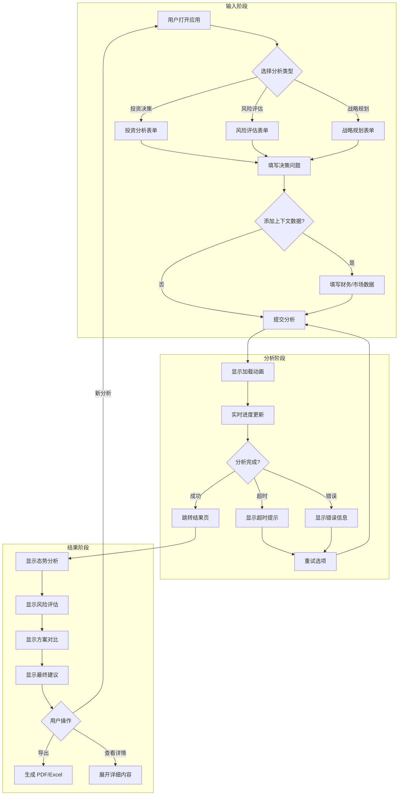
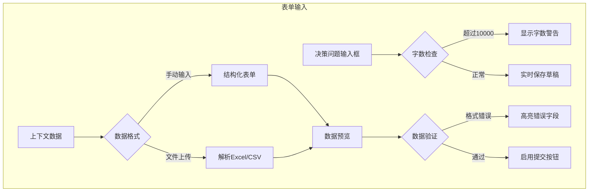
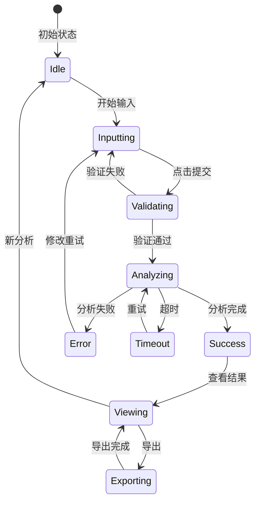
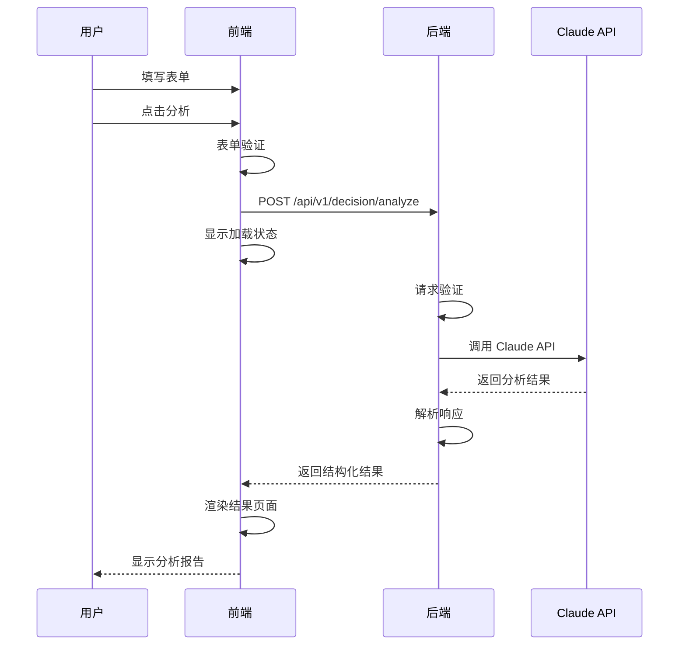

# 决策分析交互流程图

> **创建日期**: 2026-01-12
> **创建人**: 前端开发 (Frontend Dev)
> **关联文档**: UI_DESIGN_GUIDE.md, US_001_basic_analysis.md

---

## 一、UI 设计验证

### 1.1 验证结论

| 验证项 | 状态 | 说明 |
|--------|------|------|
| P0 页面覆盖 | ✅ | 决策分析中心已设计 |
| 用户流程完整 | ✅ | 输入→分析→结果→导出 |
| 响应式设计 | ✅ | 移动优先 |
| 信息架构 | ✅ | 分层展示（概览→详情）|

### 1.2 P0 页面清单

| 页面 | 对应用例 | MVP 状态 |
|------|---------|---------|
| 决策分析输入页 | US-001 | ✅ MVP 必需 |
| 分析进度页 | US-001 | ✅ MVP 必需 |
| 分析结果页 | US-001/002/003 | ✅ MVP 必需 |
| 首页/仪表板 | - | ⏳ Phase 2 |
| 历史记录页 | - | ⏳ Phase 2 |

---

## 二、核心交互流程

### 2.1 决策分析主流程



### 2.2 表单交互流程



---

## 三、页面状态机

### 3.1 分析状态



### 3.2 UI 状态定义

| 状态 | UI 表现 | 可用操作 |
|------|--------|---------|
| Idle | 空白表单，提交按钮禁用 | 输入内容 |
| Inputting | 表单填写中，字数计数 | 继续输入、提交 |
| Validating | 提交按钮 loading | 等待 |
| Analyzing | 全屏加载动画+进度 | 取消 |
| Success | 结果页展示 | 导出、新分析、查看详情 |
| Error | 错误提示弹窗 | 重试、修改 |
| Timeout | 超时提示 | 重试、取消 |

---

## 四、组件交互规范

### 4.1 决策问题输入框

```
┌────────────────────────────────────────────────────────┐
│  请描述您的决策问题                                      │
│  ┌──────────────────────────────────────────────────┐  │
│  │                                                  │  │
│  │  我们公司Q3业绩下滑，现在有一个扩张投资机会，     │  │
│  │  需要500-1000万，应该如何决策？                   │  │
│  │                                                  │  │
│  │                                                  │  │
│  │                                                  │  │
│  └──────────────────────────────────────────────────┘  │
│                                          125 / 10000   │
└────────────────────────────────────────────────────────┘

交互规则:
- 实时字数统计
- 超过 9000 字显示黄色警告
- 超过 10000 字显示红色，禁止继续输入
- 支持 Markdown 格式（可选）
```

### 4.2 上下文数据表单

```
┌────────────────────────────────────────────────────────┐
│  财务数据（可选）                                        │
│  ┌──────────────────────────────────────────────────┐  │
│  │  季度    │  收入(万)  │  利润(万)  │  现金流(万)  │  │
│  │──────────────────────────────────────────────────│  │
│  │  Q1      │  1200     │  180      │  150        │  │
│  │  Q2      │  1350     │  210      │  180        │  │
│  │  Q3      │  1100     │  95       │  40         │  │
│  │──────────────────────────────────────────────────│  │
│  │  [+ 添加季度]                                     │  │
│  └──────────────────────────────────────────────────┘  │
│                                                        │
│  市场信息（可选）                                        │
│  ┌──────────────────────────────────────────────────┐  │
│  │  行业增长率: [    -5%    ]                        │  │
│  │  主要竞争对手: [A公司, B公司]            [+ 添加]  │  │
│  └──────────────────────────────────────────────────┘  │
│                                                        │
│  [上传 Excel 文件]                                      │
└────────────────────────────────────────────────────────┘

交互规则:
- 表格支持动态增删行
- 输入框支持数字验证
- 上传 Excel 自动解析并填充
```

### 4.3 分析进度展示

```
┌────────────────────────────────────────────────────────┐
│                                                        │
│                    ◉◉◉◉◉○○○○○                         │
│                    正在分析中...                        │
│                                                        │
│                  预计还需 15-20 秒                      │
│                                                        │
│           ┌─────────────────────────────┐              │
│           │  ✓ 理解您的问题              │              │
│           │  ✓ 分析财务数据              │              │
│           │  ◉ 评估风险因素              │              │
│           │  ○ 生成决策方案              │              │
│           │  ○ 整理最终建议              │              │
│           └─────────────────────────────┘              │
│                                                        │
│                   [ 取消分析 ]                          │
│                                                        │
└────────────────────────────────────────────────────────┘

交互规则:
- 进度条动画（不阻塞）
- 分步骤提示（模拟进度）
- 预估时间显示
- 支持取消操作
```

### 4.4 分析结果展示

```
┌────────────────────────────────────────────────────────┐
│  决策分析报告                            [导出] [分享]  │
├────────────────────────────────────────────────────────┤
│                                                        │
│  ▼ 态势分析                                            │
│  ┌──────────────────────────────────────────────────┐  │
│  │  公司Q3业绩明显下滑，收入同比下降18%，利润下降    │  │
│  │  55%，现金流紧张。在行业增速放缓、人力成本上涨    │  │
│  │  的环境下，扩张投资存在较高风险。                 │  │
│  │                                                  │  │
│  │  关键发现:                                        │  │
│  │  • Q3现金流仅40万，同比下降78%                    │  │
│  │  • 现金储备800万，仅够支撑8-10个月运营            │  │
│  │  • 竞争对手A、B公司逆势增长                       │  │
│  └──────────────────────────────────────────────────┘  │
│                                                        │
│  ▼ 风险评估                                            │
│  ┌──────────────────────────────────────────────────┐  │
│  │       总体风险评分                                │  │
│  │                                                  │  │
│  │        ████████░░  7/10  高风险                  │  │
│  │                                                  │  │
│  │  ┌──────────┬────────┬──────────────────────┐   │  │
│  │  │ 风险类型  │ 等级   │ 原因                 │   │  │
│  │  │──────────│────────│──────────────────────│   │  │
│  │  │ 现金流风险│ 🔴高   │ 储备仅够8-10个月     │   │  │
│  │  │ 市场风险  │ 🟡中   │ 行业增速放缓         │   │  │
│  │  │ 执行风险  │ 🟡中   │ 人力成本上涨         │   │  │
│  │  └──────────┴────────┴──────────────────────┘   │  │
│  └──────────────────────────────────────────────────┘  │
│                                                        │
│  ▼ 方案对比                                            │
│  ┌──────────────────────────────────────────────────┐  │
│  │  ┌────────────┐  ┌────────────┐  ┌────────────┐  │  │
│  │  │ 方案A      │  │ 方案B ⭐   │  │ 方案C      │  │  │
│  │  │ 暂缓投资   │  │ 小规模试点 │  │ 全面扩张   │  │  │
│  │  │            │  │            │  │            │  │  │
│  │  │ 投资: 0    │  │ 投资: 300万│  │ 投资: 800万│  │  │
│  │  │ 风险: 🟢低 │  │ 风险: 🟡中 │  │ 风险: 🔴高 │  │  │
│  │  │            │  │            │  │            │  │  │
│  │  │ [查看详情] │  │ [查看详情] │  │ [查看详情] │  │  │
│  │  └────────────┘  └────────────┘  └────────────┘  │  │
│  └──────────────────────────────────────────────────┘  │
│                                                        │
│  ▼ 最终建议                                            │
│  ┌──────────────────────────────────────────────────┐  │
│  │  推荐: 方案B - 小规模试点投资                     │  │
│  │                                                  │  │
│  │  考虑到Q3业绩下滑和现金流压力，全面扩张风险过高。 │  │
│  │  建议采取小规模试点策略，用300万验证市场需求，    │  │
│  │  同时保留500万现金缓冲。                          │  │
│  └──────────────────────────────────────────────────┘  │
│                                                        │
└────────────────────────────────────────────────────────┘
```

---

## 五、响应式设计

### 5.1 断点定义

| 断点 | 尺寸 | 布局 |
|------|------|------|
| Mobile | < 768px | 单列，折叠式 |
| Tablet | 768px - 1024px | 双列 |
| Desktop | > 1024px | 多列，侧边栏 |

### 5.2 移动端适配

```
Mobile 布局 (< 768px)
┌─────────────────┐
│  CEOAgent       │
├─────────────────┤
│                 │
│  决策问题       │
│  ┌───────────┐  │
│  │           │  │
│  │           │  │
│  └───────────┘  │
│                 │
│  [+ 添加数据]   │
│                 │
│  [  分析  ]     │
│                 │
└─────────────────┘

- 表单全宽显示
- 底部固定提交按钮
- 可折叠的上下文数据区域
```

---

## 六、前后端接口对齐

### 6.1 接口调用时序



### 6.2 请求/响应格式

**请求** (符合 API_DESIGN.md):
```json
{
  "query": "决策问题描述",
  "context": {
    "company_financials": {...},
    "market_info": {...}
  }
}
```

**响应** (符合 API_DESIGN.md):
```json
{
  "success": true,
  "data": {
    "analysis_id": "uuid",
    "query": "...",
    "result": {
      "situation_analysis": {...},
      "risk_assessment": {...},
      "recommendations": [...],
      "final_recommendation": {...}
    }
  },
  "metadata": {...}
}
```

---

## 七、验证结论

✅ **前端设计验证通过**

- UI 设计覆盖所有 P0 用例
- 交互流程完整且用户友好
- 响应式设计满足移动端需求
- 前后端接口定义一致

---

## 更新日志

| 日期 | 修改内容 | 修改人 |
|------|---------|--------|
| 2026-01-12 | 创建决策分析交互流程图 | Frontend |
