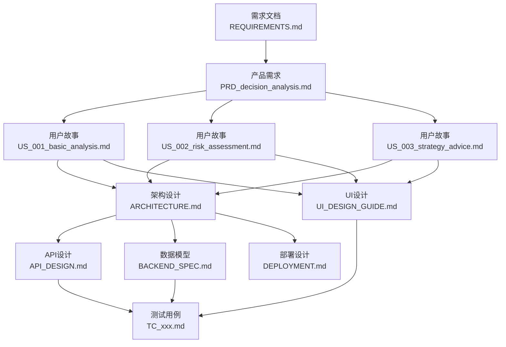

# 需求追踪矩阵

> **目的**: 追踪需求从定义到实现的完整链路，确保所有需求都被覆盖。
> **最后更新**: 2026-01-12
> **更新人**: PM

---

## 一、追踪概览

### 1.1 追踪状态说明

| 状态 | 说明 |
|------|------|
| ✅ | 已完成 |
| 🔄 | 进行中 |
| ⏳ | 待开始 |
| ❌ | 未覆盖 |
| N/A | 不适用 |

### 1.2 追踪统计

| 维度 | 总数 | 已覆盖 | 覆盖率 |
|------|------|--------|--------|
| 需求 → 用户故事 | 5 | 3 | 60% |
| 用户故事 → 架构设计 | 3 | 3 | 100% |
| 用户故事 → API 设计 | 3 | 3 | 100% |
| 用户故事 → 测试用例 | 3 | 0 | 0% |
| 用户故事 → UI 设计 | 3 | 1 | 33% |

---

## 二、核心需求追踪

### 2.1 功能需求追踪 (MVP Phase 1)

| 需求ID | 需求描述 | 来源 | 用户故事 | 架构设计 | API设计 | 测试用例 | UI设计 | 状态 |
|--------|---------|------|---------|---------|---------|---------|--------|------|
| REQ-F01 | 投资决策分析 | PRD-001 | US-001 | ARCHITECTURE.md | API_DESIGN.md#decision | ⏳ TC_US001 | PAGE_decision | 🔄 |
| REQ-F02 | 风险评估 | PRD-001 | US-002 | ARCHITECTURE.md | API_DESIGN.md#decision | ⏳ TC_US002 | PAGE_decision | 🔄 |
| REQ-F03 | 战略建议 | PRD-001 | US-003 | ARCHITECTURE.md | API_DESIGN.md#decision | ⏳ TC_US003 | PAGE_decision | 🔄 |
| REQ-F04 | 结构化输出 | PRD-001 | US-001/002/003 | ARCHITECTURE.md | API_DESIGN.md | N/A | N/A | ✅ |
| REQ-F05 | 对话上下文 | PRD-001 | (内嵌于US-001) | MEMORY_SYSTEM.md | API_DESIGN.md | ⏳ | N/A | 🔄 |
| REQ-F06 | REST API | PRD-001 | N/A | API_DESIGN.md | API_DESIGN.md | ⏳ | N/A | 🔄 |

### 2.2 功能需求追踪 (Phase 2+，MVP 不包含)

| 需求ID | 需求描述 | 来源 | 计划阶段 | 状态 |
|--------|---------|------|---------|------|
| REQ-F07 | 实时数据集成 | REQUIREMENTS.md | Phase 2 | ⏳ |
| REQ-F08 | 多轮深度对话 | PRD-001 | Phase 2 | ⏳ |
| REQ-F09 | 用户认证 | REQUIREMENTS.md | Phase 2 | ⏳ |
| REQ-F10 | 历史决策追踪 | PRD-001 | Phase 2 | ⏳ |
| REQ-F11 | 知识库检索(RAG) | REQUIREMENTS.md | Phase 3 | ⏳ |
| REQ-F12 | 多Agent协作 | REQUIREMENTS.md | Phase 4 | ⏳ |

### 2.3 非功能需求追踪

| 需求ID | 需求描述 | 目标值 | 架构设计 | 测试用例 | 部署设计 | 状态 |
|--------|---------|--------|---------|---------|---------|------|
| NFR-001 | 响应时间 | < 30 秒 | ARCHITECTURE.md | ⏳ TC_PERF | DEPLOYMENT.md | 🔄 |
| NFR-002 | 并发用户 | 10 用户 | ARCHITECTURE.md | ⏳ TC_PERF | DEPLOYMENT.md | 🔄 |
| NFR-003 | 可用性 | 99% | ARCHITECTURE.md | ⏳ TC_AVAIL | DEPLOYMENT.md | 🔄 |
| NFR-004 | 数据传输安全 | HTTPS | SECURITY.md | ⏳ TC_SEC | DEPLOYMENT.md | 🔄 |
| NFR-005 | 输入验证 | Pydantic | BACKEND_SPEC.md | ⏳ TC_INPUT | N/A | 🔄 |
| NFR-006 | 测试覆盖 | > 80% | N/A | ⏳ | N/A | ⏳ |
| NFR-007 | 日志记录 | 结构化日志 | MONITORING.md | N/A | DEPLOYMENT.md | 🔄 |

---

## 三、用户故事追踪

### 3.1 P0 用户故事（核心，MVP 必须）

| 用户故事 | 描述 | 验收标准数 | 架构设计 | API设计 | 测试用例 | UI设计 | 状态 |
|---------|------|-----------|---------|---------|---------|--------|------|
| US-001 | 基础投资分析请求 | 11 条 | ✅ ARCHITECTURE.md | ✅ API_DESIGN.md | ⏳ | ✅ UI_DESIGN_GUIDE.md | 🔄 |
| US-002 | 风险评估 | 10 条 | ✅ ARCHITECTURE.md | ✅ API_DESIGN.md | ⏳ | ✅ UI_DESIGN_GUIDE.md | 🔄 |
| US-003 | 战略建议 | 10 条 | ✅ ARCHITECTURE.md | ✅ API_DESIGN.md | ⏳ | ✅ UI_DESIGN_GUIDE.md | 🔄 |

### 3.2 P1 用户故事（重要，Phase 2）

| 用户故事 | 描述 | 验收标准 | 架构设计 | API设计 | 测试用例 | UI设计 | 状态 |
|---------|------|---------|---------|---------|---------|--------|------|
| US-004 | 自然语言对话 | - | ⏳ | ⏳ | ⏳ | ⏳ | ⏳ |
| US-005 | 知识检索 | - | ⏳ | ⏳ | ⏳ | ⏳ | ⏳ |

### 3.3 验收标准详细映射

#### US-001 验收标准

| AC编号 | 验收标准描述 | 类型 | API接口 | 测试用例 |
|--------|-------------|------|---------|---------|
| AC-1 | 30秒内返回结构化分析结果 | 功能+性能 | POST /api/v1/decision/analyze | ⏳ TC_US001_01 |
| AC-2 | 响应包含四部分内容 | 功能 | POST /api/v1/decision/analyze | ⏳ TC_US001_02 |
| AC-3 | 风险评分 1-10 范围 | 功能 | POST /api/v1/decision/analyze | ⏳ TC_US001_03 |
| AC-4 | 至少 2 个可选方案 | 功能 | POST /api/v1/decision/analyze | ⏳ TC_US001_04 |
| AC-5 | 最终建议包含推荐理由 | 功能 | POST /api/v1/decision/analyze | ⏳ TC_US001_05 |
| AC-6 | 空查询返回 400 错误 | 输入验证 | POST /api/v1/decision/analyze | ⏳ TC_US001_06 |
| AC-7 | 超长查询返回 400 错误 | 输入验证 | POST /api/v1/decision/analyze | ⏳ TC_US001_07 |
| AC-8 | 格式错误返回具体问题 | 输入验证 | POST /api/v1/decision/analyze | ⏳ TC_US001_08 |
| AC-9 | API 超时返回 504 | 错误处理 | POST /api/v1/decision/analyze | ⏳ TC_US001_09 |
| AC-10 | API 错误返回 502 | 错误处理 | POST /api/v1/decision/analyze | ⏳ TC_US001_10 |
| AC-11 | 解析失败返回 500 | 错误处理 | POST /api/v1/decision/analyze | ⏳ TC_US001_11 |

#### US-002 验收标准

| AC编号 | 验收标准描述 | 类型 | API接口 | 测试用例 |
|--------|-------------|------|---------|---------|
| AC-1 | 返回总体风险评分和等级 | 功能 | POST /api/v1/decision/analyze | ⏳ TC_US002_01 |
| AC-2 | 覆盖所有指定风险领域 | 功能 | POST /api/v1/decision/analyze | ⏳ TC_US002_02 |
| AC-3 | 返回风险矩阵 | 功能 | POST /api/v1/decision/analyze | ⏳ TC_US002_03 |
| AC-4 | 高优先级风险有缓解措施 | 功能 | POST /api/v1/decision/analyze | ⏳ TC_US002_04 |
| AC-5 | 返回监控计划 | 功能 | POST /api/v1/decision/analyze | ⏳ TC_US002_05 |
| AC-6 | 财务异常时评分>=8 | 业务逻辑 | POST /api/v1/decision/analyze | ⏳ TC_US002_06 |
| AC-7 | 多风险叠加效应 | 业务逻辑 | POST /api/v1/decision/analyze | ⏳ TC_US002_07 |
| AC-8 | 恶化趋势提高优先级 | 业务逻辑 | POST /api/v1/decision/analyze | ⏳ TC_US002_08 |
| AC-9 | 默认评估三类风险 | 输入处理 | POST /api/v1/decision/analyze | ⏳ TC_US002_09 |
| AC-10 | 数据不完整时说明 | 输入处理 | POST /api/v1/decision/analyze | ⏳ TC_US002_10 |

#### US-003 验收标准

| AC编号 | 验收标准描述 | 类型 | API接口 | 测试用例 |
|--------|-------------|------|---------|---------|
| AC-1 | 返回完整战略评估 | 功能 | POST /api/v1/decision/analyze | ⏳ TC_US003_01 |
| AC-2 | 推荐战略含3-4个支柱 | 功能 | POST /api/v1/decision/analyze | ⏳ TC_US003_02 |
| AC-3 | 每个支柱含目标/举措/KPI | 功能 | POST /api/v1/decision/analyze | ⏳ TC_US003_03 |
| AC-4 | 按季度实施路线图 | 功能 | POST /api/v1/decision/analyze | ⏳ TC_US003_04 |
| AC-5 | 返回资源需求估算 | 功能 | POST /api/v1/decision/analyze | ⏳ TC_US003_05 |
| AC-6 | 至少3个可量化KPI | 功能 | POST /api/v1/decision/analyze | ⏳ TC_US003_06 |
| AC-7 | 至少2个备选战略 | 功能 | POST /api/v1/decision/analyze | ⏳ TC_US003_07 |
| AC-8 | 备选战略含优缺点 | 功能 | POST /api/v1/decision/analyze | ⏳ TC_US003_08 |
| AC-9 | 资源不超约束条件 | 一致性 | POST /api/v1/decision/analyze | ⏳ TC_US003_09 |
| AC-10 | 利用SWOT制定战略 | 一致性 | POST /api/v1/decision/analyze | ⏳ TC_US003_10 |

---

## 四、文档关联关系

### 4.1 文档依赖图



### 4.2 文档影响关系

当一个文档变更时，需要检查以下文档是否需要同步更新：

| 变更文档 | 可能影响的文档 |
|---------|--------------|
| REQUIREMENTS.md | PRD、用户故事、架构设计、测试用例 |
| PRD_decision_analysis.md | 用户故事、架构设计、测试用例、UI设计 |
| US_001/002/003.md | 架构设计、API设计、测试用例、UI设计 |
| ARCHITECTURE.md | API设计、数据模型、部署设计、测试用例 |
| API_DESIGN.md | 前端设计、测试用例、BACKEND_SPEC.md |
| BACKEND_SPEC.md | API设计、测试用例 |
| UI_DESIGN_GUIDE.md | 测试用例 |

---

## 五、版本管理

### 5.1 版本命名规范

- 格式: `v主版本.次版本`
- 主版本: 重大变更
- 次版本: 小修改

### 5.2 文档版本记录

| 文档 | 当前版本 | 最后更新 | 更新人 | 状态 |
|------|---------|---------|--------|------|
| REQUIREMENTS.md | v1.0 | 2026-01-12 | PM | APPROVED |
| PRD_decision_analysis.md | v1.0 | 2026-01-12 | PM | DRAFT |
| US_001_basic_analysis.md | v1.0 | 2026-01-12 | PM | DRAFT |
| US_002_risk_assessment.md | v1.0 | 2026-01-12 | PM | DRAFT |
| US_003_strategy_advice.md | v1.0 | 2026-01-12 | PM | DRAFT |
| ARCHITECTURE.md | v1.0 | 2026-01-12 | Arch | DRAFT |
| API_DESIGN.md | v1.0 | 2026-01-12 | Arch | DRAFT |
| USE_CASES.md | v1.0 | 2026-01-12 | PM | DRAFT |

### 5.3 版本变更流程

```
1. 文档修改
         │
         ▼
2. 更新版本号
         │
         ▼
3. 更新变更记录
         │
         ▼
4. 检查影响的文档
         │
         ▼
5. 提交评审
         │
         ▼
6. 同步更新相关文档
```

---

## 六、一致性检查

### 6.1 检查清单

#### 需求与用户故事一致性
- [x] 所有 MVP 需求都有对应的用户故事
- [x] 用户故事覆盖所有 MVP 需求点
- [x] 验收标准与需求一致

#### 用户故事与设计一致性
- [x] 所有 P0 用户故事都有对应的架构设计
- [x] 所有 P0 用户故事都有对应的 API 设计
- [x] 所有 P0 用户故事都有对应的 UI 设计

#### 设计与测试一致性
- [ ] 所有 API 都有对应的测试用例
- [ ] 所有 UI 流程都有对应的测试用例
- [ ] 测试用例覆盖所有验收标准

#### 前后端一致性
- [x] API 请求参数一致（参考 API_DESIGN.md）
- [x] API 响应格式一致（参考 API_DESIGN.md）
- [x] 错误码定义一致（参考 API_DESIGN.md）

### 6.2 一致性检查记录

| 检查日期 | 检查范围 | 发现问题 | 处理状态 |
|---------|---------|---------|---------|
| 2026-01-12 | PRD vs US | 无重大问题 | ✅ 通过 |
| 2026-01-12 | US vs API | API 设计覆盖所有用户故事 | ✅ 通过 |
| 2026-01-12 | US vs TC | 测试用例待创建 | ⏳ 待处理 |

---

## 七、追踪更新流程

### 7.1 更新时机

- 新增需求/用户故事时
- 完成设计文档时
- 完成测试用例时
- 文档变更时

### 7.2 更新责任

| 追踪维度 | 更新责任人 |
|---------|-----------|
| 需求 → 用户故事 | PM |
| 用户故事 → 架构设计 | Architect |
| 用户故事 → API 设计 | BE |
| 用户故事 → 测试用例 | QA |
| 用户故事 → UI 设计 | FE |

---

## 八、验证结论

### 8.1 PM 需求验证结论

| 验证项 | 状态 | 说明 |
|--------|------|------|
| PRD 完整性 | ✅ | PRD-001 包含背景、用户画像、功能范围、非功能需求 |
| PRD-US 一致性 | ✅ | 3 个 P0 用户故事覆盖 PRD 核心功能 |
| 验收标准完整性 | ✅ | US-001/002/003 共 31 条验收标准 |
| 优先级划分 | ✅ | P0(MVP)/P1(Phase2)/P2(Phase3+) 划分清晰 |
| 范围边界 | ✅ | In Scope/Out of Scope 明确定义 |

### 8.2 待完成项

| 待完成项 | 负责人 | 优先级 |
|---------|--------|--------|
| 创建 P0 用户故事测试用例 | QA | P0 |
| 创建 P1 用户故事详细文档 | PM | P1 |
| 完成 UI 设计详细规范 | FE | P1 |

---

## 九、更新日志

| 日期 | 修改内容 | 修改人 |
|------|---------|--------|
| 2026-01-12 | 创建需求追踪矩阵框架 | - |
| 2026-01-12 | PM 填充实际追踪数据，完成需求验证 | PM |
